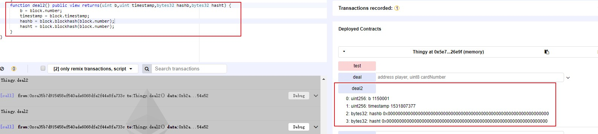
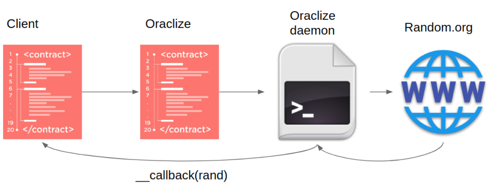

# 以太坊智能合约中随机数预测 

## 前言

作为首次币发行（ICO）的平台，以太坊已经获得了极大的普及。 但是，它不仅仅用于 ERC20 通证，轮盘，彩票和纸牌游戏都可以使用以太坊区块链实现。 与任何区块链实施一样，以太坊是不可逆的，去中心化的，透明公开的。 以太坊允许运行图灵完备程序，这些程序通常用 Solidity 编写，使其成为平台创始人所说的“世界超级计算机”。 对于计算机赌博来说，所有这些特征都是非常有益的，尤其是用户信用。

而这类应用必不可少的部分就是产生随机数，但是以太坊区块链通过打包区块来实现数据存储，数据需要非常高的确定性，这为编写伪随机数发生器（PRNG）带来了一定的难度。

## PRNG相关漏洞类型

开发者生成随机数时，一般都会使用伪随机数生成器(pseudo-random number generator)，简称 `PRNG`。而有漏洞的PRNG，一般有四种类型：

- 使用区块变量作为熵源的 PRNG

- 基于过往区块的区块哈希的 PRNG

- 基于过往区块和私有种子(seed)的区块哈希的 PRNG

- 易被抢占交易(front-running)的 PRNG

下面我们来分别一一详解。

### 使用区块变量作为熵源的 PRNG

- . block.coinbase 表示当前区块的矿工地址

- . block.difficulty 表示当前区块的挖掘难度

- . block.gaslimit 区块内交易的最大限制燃气消耗量

- . block.number 表示当前区块高度

- . block.timestamp 表示当前区块挖掘时间

以上所有的区块变量都可以被矿工操纵，所以都不能用来做信息熵源。因为这些区块变量在同一区块上是共用的。攻击者通过其恶意合约调用受害者合约，那么此交易打包在同一区块中，其区块变量是一样的。

示例1：<[https://etherscan.io/address/0x80ddae5251047d6ceb29765f38fed1c0013004b7](https://etherscan.io/address/0x80ddae5251047d6ceb29765f38fed1c0013004b7)>

```

// 如果 block.number 是偶数，则 won 输出为 true。 

bool won = (block.number % 2) == 0;

```


示例2：<[https://etherscan.io/address/0xa11e4ed59dc94e69612f3111942626ed513cb172](https://etherscan.io/address/0xa11e4ed59dc94e69612f3111942626ed513cb172)>

```

var random = uint(sha3(block.timestamp)) % 2;

```


示例3：<[https://etherscan.io/address/0xcC88937F325d1C6B97da0AFDbb4cA542EFA70870](https://etherscan.io/address/0xcC88937F325d1C6B97da0AFDbb4cA542EFA70870)>


```

address seed1 = contestants[uint(block.coinbase) % totalTickets].addr;

address seed2 = contestants[uint(msg.sender) % totalTickets].addr;

uint seed3 = block.difficulty;

bytes32 randHash = keccak256(seed1, seed2, seed3);

uint winningNumber = uint(randHash) % totalTickets;

address winningAddress = contestants[winningNumber].addr;

```

示例4 : 使用 block.difficulty

```

pragma solidity ^0.4.0;

contract random{

   function rand() public returns(uint256) {

        uint256 random = uint256(keccak256(block.difficulty,now));

        return  random%10;

    }

}

```

### 基于过往区块的区块哈希的 PRNG

每一个Ethereum区块链上的区块都有认证的hash值，通过 block.blockhash() 函数可以获取此值。此函数经常被错误地使用。

- block.blockhash(block.number) ：基于当前区块的区块哈希

- block.blockhash(block.number – 1) ： 基于负一区块的区块哈希

- block.blockhash() of a block that is at least 256 blocks older than the current one ： 比当前区块小256个区块高度的区块哈希。


#### block.blockhash(block.number)

通过 `block.number` 变量可以获取当前区块区块高度。但是还没执行时，这个“当前区块”是一个未来区块，即只有当一个矿工拾取一个执行合约代码的交易时，这个未来区块才变为当前区块，所以合约才可以可靠地获取此区块的区块哈希。而一些合约曲解了 `block.blockhash(block.number)` 的含义，误认为当前区块的区块哈希在运行过程中是已知的，并将之做为熵源。还有一点就是在以太坊虚拟机中(EVM)，区块哈希恒为 0。



示例1：<[https://etherscan.io/address/0xa65d59708838581520511d98fb8b5d1f76a96cad](https://etherscan.io/address/0xa65d59708838581520511d98fb8b5d1f76a96cad)>

```
function deal(address player, uint8 cardNumber) internal returns (uint8) {

  uint b = block.number;

  uint timestamp = block.timestamp;

  return uint8(uint256(keccak256(block.blockhash(b), player, cardNumber, timestamp)) % 52);

}
```

示例2：<[https://github.com/axiomzen/eth-random/issues/3](https://github.com/axiomzen/eth-random/issues/3)>

```

function random(uint64 upper) public returns (uint64 randomNumber) {

  _seed = uint64(sha3(sha3(block.blockhash(block.number), _seed), now));

  return _seed % upper;

}
```

#### block.blockhash(block.number-1)

有一些合约则基于负一高度区块区块哈希来产生伪随机数，这也是有缺陷的。攻击合约只要以相同代码执行，即可以产生到同样的伪随机数。

示例：<[https://etherscan.io/address/0xF767fCA8e65d03fE16D4e38810f5E5376c3372A8](https://etherscan.io/address/0xF767fCA8e65d03fE16D4e38810f5E5376c3372A8)>

```

//Generate random number between 0 & max

uint256 constant private FACTOR =  1157920892373161954235709850086879078532699846656405640394575840079131296399;

function rand(uint max) constant private returns (uint256 result){

  uint256 factor = FACTOR * 100 / max;

  uint256 lastBlockNumber = block.number - 1;

  uint256 hashVal = uint256(block.blockhash(lastBlockNumber));

  return uint256((uint256(hashVal) / factor)) % max;

}

```


#### Blockhash of a future block

一个更好的方法是使用未来区块的区块哈希。示例应用执行的脚本逻辑示例如下：

- 玩家发起下注，以当前区块高度下注，庄家存储此区块高度。

- 玩家第二次调用时，调用庄家公布赢家的功能。

- 庄家检索存储的区块高度，并以此区块高度的区块哈希来产生伪随机数。

此方法只有在十分必要的时候才能使用。因为也存在一定危险性，EVM 能存储的区块哈希为最近的 256 条。超过的话值为 0。

因此，如果第二次调用时，与第一次下注时的区块高度差超过了 256，那么此时的产生的区块哈希为 0，此时伪随机数就变成可猜测的了。

一个众所周知的案例是 SmartBillions lottery。合约对区块高度的验证不足，导致了 400 ETH 的损失 

相关资料：<[https://www.reddit.com/r/ethereum/comments/74d3dc/smartbillions_lottery_contract_just_got_hacked/](https://www.reddit.com/r/ethereum/comments/74d3dc/smartbillions_lottery_contract_just_got_hacked/)>

#### Blockhash with a private seed

为了增加熵值，有些合约使用一个私有种子(seed)变量。

如 Slotthereum lottery 合约：

```
// case of Slotthereum lottery

bytes32 _a = block.blockhash(block.number - pointer);

for (uint i = 31; i >= 1; i--) {

  if ((uint8(_a[i]) >= 48) && (uint8(_a[i]) <= 57)) {

    return uint8(_a[i]) - 48;

  }

}

```


这里的变量 `pointer` 被声明为私有变量。每回游戏结束后，胜出的数字为1到9，此数字被放到 `pointer` 上，然后做为下次区块哈希计算时的区块高度偏移量。

虽然私有变量相对其它合约是不可见的，但是我们可以以链下的方式去获取链上的存储信息。如使用客户端的 web3 API 方法 web3.eth.getStorageAt()，可以检索合约的存储。

由此，通过获取此私有变量 `pointer` 后，我们可以使用如下代码进行攻击：

```

function attack(address a, uint8 n) payable {

  Slotthereum target = Slotthereum(a);

  pointer = n;

  uint8 win = getNumber(getBlockHash(pointer));

  target.placeBet.value(msg.value)(win, win);

}

```

### Front-running 抢先交易

原理：更高的 gas 价格，交易将更快被矿工拾取打包。

为了获取最大的奖励，矿工通过每个交易的 gas 累积值来选择并创建新的区块。而这些交易的排序是基于它们的 gas 价格。最高的 gas 价格会先被执行。由此通过操纵 gas 价格，可以将交易的顺序排在当前区块的前面。这就会引发抢占交易问题。

案例1：

一个用于彩票的合约，使用 External oracles 方法来获取伪随机数，这些伪随机数是明文存放的，用于决定胜出者。攻击者观察 `pending` 状态的交易，如果出现交易包含 oracle 伪随机数的信息，那么攻击者马上使用更高的 gas 价格来发起包含此伪随机数的交易，此交易就可以更快地完成，让攻击者胜出。

案例2：

另一个案例是 `Last is me!` 游戏合约。每当玩家购买一张票时，该玩家就会声明最后一个座位并且开始倒计时。如果没有人在一定数量的区块内购买门票，那么“坐下来”的最后一名选手将获得累积奖金。当该轮即将结束时，攻击者可以观察交易池以获得其他参赛者的交易，并通过更高的汽油价格获得累积奖金。

合约地址： [https://etherscan.io/address/0x5d9b8fa00c16bcafae47deed872e919c8f6535bf#code ](https://etherscan.io/address/0x5d9b8fa00c16bcafae47deed872e919c8f6535bf#code )

## 较安全伪随机数的产生方法

- External oracles: Oraclize

- External oracles: BTCRelay

- Signidice

- Commit–reveal approach

### External oracles: Oraclize

Oraclize 提供了一个连接以太坊与外部环境(互联网)的桥梁。通过 Oraclize，智能合约能够通过 web API 请求数据。如当前的兑换率，天气预报或股票价格。其中一个最大的作用是能提供伪随机数。一些合约通过 Oraclize 中的 URL 连接器来连接 [random.org](https://www.random.org/) 来获取伪随机数。如下图所示： 



主要的缺陷就是中心化了。但我们可以相信 Oraclize 不会篡改结果吗？我们可以信任 `random.org` 和它的底层实现吗？虽然 Oraclize 提供 TLSNotary 的结果验证，但是它只能在链下使用。比如说，在彩票合约中，只有赢家被选出后才能使用。更好的方法是使用可以在链上验证的 Ledger 证明的随机数据。

相关资料：

    Ledger 证明：
    
<[https://blog.oraclize.it/welcoming-our-brand-new-ledger-proof-649b9f098ccc](https://blog.oraclize.it/welcoming-our-brand-new-ledger-proof-649b9f098ccc)>

<[https://github.com/oraclize/ethereum-examples/tree/master/solidity](https://github.com/oraclize/ethereum-examples/tree/master/solidity)>

<[http://dapps.oraclize.it/browser-solidity/#gist=9817193e5b05206847ed1fcd1d16bd1d&version=soljson-v0.4.20-nightly.2018.1.29+commit.a668b9de.js&optimize=false](http://dapps.oraclize.it/browser-solidity/#gist=9817193e5b05206847ed1fcd1d16bd1d&version=soljson-v0.4.20-nightly.2018.1.29+commit.a668b9de.js&optimize=false)>

<[http://docs.oraclize.it](http://docs.oraclize.it)>
### External oracles: BTCRelay

BTCRelay 是以太坊和比特币区块链之间的桥梁。使用 BTCRelay，以太坊区块链中的智能合约可以请求未来的比特币区块哈希并将其作为熵源。项目 `The Ethereum Lottery` 使用 BTCRelay 作为 PRNG。

不过 BTCRelay 方法对矿工的激励问题不太安全。 尽管与依赖以太坊区块相比，这种方法拥有更高的安全障碍，但事实上它只是利用了比特币的价格高于以太网，从而减少矿工作弊的风险，但并不能完全消除此风险。

相关资料：

<[http://btcrelay.org/](http://btcrelay.org/)>

### Signidice

Signidice 是一种基于加密签名的算法，但仅用于两种类型的智能合约中生成 PRNG ：玩家和庄家。该算法的工作原理如下：

- 玩家通过调用智能合约进行下注。

- 庄家看到赌注，用私钥将之签名，然后将签名发送给智能合约。

- 智能合约使用公钥验证此签名。

- 此签名则能够用于生成随机数。

以太坊有一个内置函数 `ecrecover()`，用于验证链上的 ECDSA 签名。但是 ECDSA 不能用于 Signidice，因为庄家能够操纵输入参数（特别是参数k），从而影响签名的结果。Alexey Pertsev 已经验证了这种作弊方法是可行的。

幸运的是，随着 Metropolis hardfork 的发布，引入了模幂运算符(modular exponentiation operator)。这允许实现 RSA 签名验证，与 ECDSA 不同，它不允许操纵输入参数来找到想要的签名。

相关资料：

  Alexey Pertsev 的证明 ： 
  
  [https://github.com/pertsev/web3_utilz/tree/master/ECDSA%20signature%20generating%20%28cheating%29 ](https://github.com/pertsev/web3_utilz/tree/master/ECDSA%20signature%20generating%20%28cheating%29)

  modular exponentiation operator：
  
  [https://github.com/ethereum/EIPs/pull/198 ](https://github.com/ethereum/EIPs/pull/198 )

  <[https://github.com/gluk256/misc/blob/master/rng4ethereum/signidice.md](https://github.com/gluk256/misc/blob/master/rng4ethereum/signidice.md)>

  <[https://github.com/pertsev/web3_utilz/tree/master/ECDSA%20signature%20generating%20(cheating)](https://github.com/pertsev/web3_utilz/tree/master/ECDSA%20signature%20generating%20(cheating))>

  <[http://andrea.corbellini.name/2015/05/30/elliptic-curve-cryptography-ecdh-and-ecdsa/](http://andrea.corbellini.name/2015/05/30/elliptic-curve-cryptography-ecdh-and-ecdsa/)>

### Commit–reveal approach

顾名思义，提交-揭示方法包括两个阶段：

- ”提交”阶段 : 一方提交加密内容给向智能合约。

- ”揭示”阶段 : 一方宣布明文种子，智能合约验证它们的正确性，并使用此种子生成随机数。

一个合理的提交-揭示方法的实现不应该单一地依赖于任何一方。 虽然玩家(player)不知道合约拥有者(owner)提交的原始种子，并且他们的机会相等，但是合约拥有者也可能是玩家，因此玩家并不能完全信任合约拥有者。

Randao 更好地实现了提交-揭示方法。 该 PRNG 从多方收集哈希种子，并且每一方都获得参与奖励。没有人知道其他人的种子，所以结果能保证真正地随机。 但是，如果有一方拒绝揭示种子，将导致合约拒绝服务。

提交-揭示方法可以与未来区块的区块哈希相结合。这个方法中，有三个熵源：

- owner’s sha3(seed1)

- player’s sha3(seed2)

- a future blockhash

然后这样生成随机数： `sha3（seed1，seed2，blockhash）`。通过此，可以解决如下问题：

- 矿工激励问题：矿工可以决定区块哈希，但不知道 合约拥有者和玩家的种子。

- 合约拥有者激励问题：合约拥有者只知道 合约拥有者自己的种子，但玩家的种子和未来区块的区块哈希是未知的。

- 解决当一个人既是 合约拥有者又是矿工时的情况：该人能决定区块哈希并且知道 合约拥有者的种子，但不知道玩家的种子。


## 资料

- [https://blog.winsome.io/random-number-generation-on-winsome-io-future-blockhashes-fe44b1c61d35](https://blog.winsome.io/random-number-generation-on-winsome-io-future-blockhashes-fe44b1c61d35 )

- [https://blog.positive.com/predicting-random-numbers-in-ethereum-smart-contracts-e5358c6b8620](https://blog.positive.com/predicting-random-numbers-in-ethereum-smart-contracts-e5358c6b8620)

- [https://blog.otlw.co/random-in-ethereum-50eefd09d33e](https://blog.otlw.co/random-in-ethereum-50eefd09d33e)

- [https://docs.oraclize.it/#ethereum-advanced-topics-computation-data-source ](https://docs.oraclize.it/#ethereum-advanced-topics-computation-data-source )
