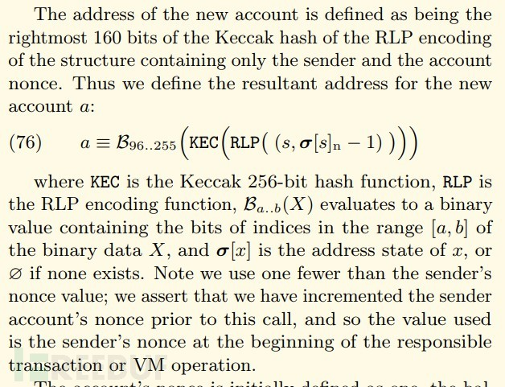

# 以太坊智能合约地址生成相关知识

## 前言

在[智能合约常见安全漏洞及修复方案](./智能合约常见安全漏洞及修复方案.md)文章中提到有一种攻击方式是`不期而至的Ether`。里面有讲到两点：

- 有两种方式可以将 Ether（强制）发送给合约，而无需使用 payable 函数或执行合约中的任何代码。
- 合约地址是确定性的，实际上地址是根据创建合约的地址及创建合约的交易 Nonce 的哈希值计算得出的。

那么下面我们就来分析合约地址是怎么生成的。

## 原理分析

以太坊内有两种类型的账户：普通账户和合约账户。 合约是通过发送带有空字段的事务(空的 to)来创建的，并且包含一些被执行的数据（一个构造函数），并且希望返回一些放在区块链上的代码。 这些合同自然是与正常账户相同的地址空间的一部分; 由此确定合同的地址：

```
address = sha3(rlp_encode(creator_account, creator_account_nonce))[12:]
```

可见黄皮书第7章”创建合约”部分：



合约地址是确定性的，由 keccack256(address,nonce) 计算。(其中 address 既可以是普通外部账户也可以是合约账户，而 nonce 是生产其它合约的一个数值(或者对于常规交易来说是交易的nonce))。

从本质上讲，合约的地址就是账户与交易 nonce 串联的 keccak256 哈希值。合约账户的 nonce 是以 1 开始的，普通外部账户的交易 nonce 是以 0 开始的。

具体的solidity函数实现如下：

```
function futureAddress(address _add,uint8 nonce) returns (address){
    if(nonce == 0){
        return address(keccak256(0xd6,0x94,_add,0x80));
    }else{
        return address(keccak256(0xd6,0x94,_add,nonce));
    }
}
```

如果你有一个生产合约 accountA 地址 0x6ac7ea33f8831ea9dcc53393aaa88b25a785dbf0 ，那么此合约创建的合约的地址将如以下顺序：

```
nonce0= "0xcd234a471b72ba2f1ccf0a70fcaba648a5eecd8d"
nonce1= "0x343c43a37d37dff08ae8c4a11544c718abb4fcf8"
nonce2= "0xf778b86fa74e846c4f0a1fbd1335fe81c00a0c91"
nonce3= "0xfffd933a0bc612844eaf0c6fe3e5b8e9b6c1d19c"
```

## 验证

### 合约账户部署合约

示例代码如下：

```
pragma solidity ^0.4.23;

contract Test{

    event TestEvent(string,uint256);
    function t() returns (uint8){
        
        uint8 a = 255;
        uint8 b = 1;
        return a+b;
        
    }
    function getBalance() public returns(uint256){
        TestEvent("[*]balance : ",this.balance);
        return this.balance;
    }
}

contract Test1{
    
    Test test;
    event TestEvent(address);
    function deploy() returns(uint8){
        test =new Test();
        emit TestEvent(test);
        return test.t();
    }
    function deposit() payable{}
    
    function transfer(address _add) returns(bool)
    {
        return _add.send(1);   
    }
    
    function caller (address _add) returns(bool){
        
        return _add.call(bytes4(keccak256("getBalance()")));
    }
    
    function getBalance() public returns(uint256){
        return this.balance;
    }
    
    function futureAddress(address _add,uint8 nonce) returns (address){
        if(nonce == 0){
            return address(keccak256(0xd6,0x94,_add,0x80));
        }else{
            return address(keccak256(0xd6,0x94,_add,nonce));
        }
    }
    
}

```

我在部署好Test1合约以后，可以通过调用函数deploy来new一个Test合约。当然我在没有通过new创建Test合约之前，我们可以通过futureAddress来预测Test的合约地址。

因此我的思路是：

1. 通过futureAddress函数计算Test合约的地址，然后调用transfer给此地址直接转以太币。
2. 调用deploy函数真正创建Test合约，然后通过调用caller函数通过call的方式调用Test合约的getBalance()函数查看Test合约是否已经成功接收以太币。
3. 如果接收，说明上章节的合约地址原理分析都是正确的。

首先我们需要在Remix里面部署Test1合约，然后将获取到的Test1的合约地址0xdc04977a2078c8ffdf086d618d1f961b6c546222带入到futureAddress计算出Test合约如果被创建的地址：这里的第一个参数是合约Test1的地址，第二个参数nonce从1开始，是因为前面讲过合约的交易的nonce是从1开始的。

```
nonce1 = 0x9318F4B5ef88fb919FC108E3F0C78b271e9682B2
nonce2 = 0xe480B8116f1d548408E9Ec68C29C9d3f851C4Dd2
nonce3 = 0xfA11F75fF9DF35A829793e46317ab2A786C45212
nonce4 = 0x8816E5F70B56947fFA6DF36B934e09111A49D92b
nonce5 = 0x07AC6833fc9507D9f9E72aBd8091D97349D12919
```
首先我们通过deposit函数给Test1合约充点以太币10wei，然后通过getBalance函数查询到Test1的以太币余额为10wei。

```
status 	0x1 Transaction mined and execution succeed
 transaction hash 	0x238356949d458fde22df4c8a939da9d302c1b3bfd9c16eaaa4f0ae1732353669
 from 	0xca35b7d915458ef540ade6068dfe2f44e8fa733c
 to 	Test1.getBalance() 0xdc04977a2078c8ffdf086d618d1f961b6c546222
 gas 	3000000 gas
        
 transaction cost 	21879 gas 
 execution cost 	607 gas 
 hash 	0x238356949d458fde22df4c8a939da9d302c1b3bfd9c16eaaa4f0ae1732353669
 input 	0x120...65fe0
 decoded input 	{}
 decoded output 	{
	"0": "uint256: 10"
}
 logs 	[]
 value 	0 wei
 
```
 
好了，这个时候我们给nonce1地址通过transfer函数转账1wei的以太币，结果如下：

```
status 	0x1 Transaction mined and execution succeed
 transaction hash 	0xdb7b4997333c8cf1037cf737ff4b34974f2086f6a9a0ce435ef41076ffc83d77
 from 	0xca35b7d915458ef540ade6068dfe2f44e8fa733c
 to 	Test1.transfer(address) 0xdc04977a2078c8ffdf086d618d1f961b6c546222
 gas 	3000000 gas
        
 transaction cost 	55459 gas 
 execution cost 	32779 gas 
 hash 	0xdb7b4997333c8cf1037cf737ff4b34974f2086f6a9a0ce435ef41076ffc83d77
 input 	0x1a6...682b2
 decoded input 	{
	"address _add": "0x9318F4B5ef88fb919FC108E3F0C78b271e9682B2"
}
 decoded output 	{
	"0": "bool: true"
}
 logs 	[]
 value 	0 wei
        
```

这里我们再次然后通过getBalance函数查询到Test1的以太币余额为9wei：

```

status 	0x1 Transaction mined and execution succeed
 transaction hash 	0x0462aa4499f845f1c5826eafe4582aae387d0677d1cbdd7458f8fd4ad571251c
 from 	0xca35b7d915458ef540ade6068dfe2f44e8fa733c
 to 	Test1.getBalance() 0xdc04977a2078c8ffdf086d618d1f961b6c546222
 gas 	3000000 gas
        
 transaction cost 	21879 gas 
 execution cost 	607 gas 
 hash 	0x0462aa4499f845f1c5826eafe4582aae387d0677d1cbdd7458f8fd4ad571251c
 input 	0x120...65fe0
 decoded input 	{}
 decoded output 	{
	"0": "uint256: 9"
}
 logs 	[]
 value 	0 wei

```

好了，那我们现在通过deploy函数来部署Test。这里为了方便查看Test的地址，我们添加了一个事件TestEvent来查看Test的地址。运行deploy的函数结果如下：

```
status 	0x1 Transaction mined and execution succeed
 transaction hash 	0x810d9dc983a5e14a6bf3f024b93b169b48a38214dfe85eecef78d8eb6b0f8b5e
 from 	0xca35b7d915458ef540ade6068dfe2f44e8fa733c
 to 	Test1.deploy() 0xdc04977a2078c8ffdf086d618d1f961b6c546222
 gas 	3000000 gas
        
 transaction cost 	158750 gas 
 execution cost 	137478 gas 
 hash 	0x810d9dc983a5e14a6bf3f024b93b169b48a38214dfe85eecef78d8eb6b0f8b5e
 input 	0x775...c300c
 decoded input 	{}
 decoded output 	{
	"0": "uint8: 0"
}
 logs 	[
	{
		"from": "0xdc04977a2078c8ffdf086d618d1f961b6c546222",
		"topic": "0xab77f9000c19702a713e62164a239e3764dde2ba5265c7551f9a49e0d304530d",
		"event": "TestEvent",
		"args": {
			"0": "0x9318F4B5ef88fb919FC108E3F0C78b271e9682B2",
			"length": 1
		}
	}
]
 value 	0 wei

```

嗯，这里从事件TestEvent的结果来看，Test的合约地址为0x9318F4B5ef88fb919FC108E3F0C78b271e9682B2即是前面原理分析的nonce1。

将0x9318F4B5ef88fb919FC108E3F0C78b271e9682B2带入到caller函数查询Test合约的余额为1:

```
status 	0x1 Transaction mined and execution succeed
 transaction hash 	0x97fbaaf64d81a9eba9fcc62d63651b75a24be793b4e2bad6da0a775a201e2511
 from 	0xca35b7d915458ef540ade6068dfe2f44e8fa733c
 to 	Test1.caller(address) 0xdc04977a2078c8ffdf086d618d1f961b6c546222
 gas 	3000000 gas
        
 transaction cost 	26794 gas 
 execution cost 	4114 gas 
 hash 	0x97fbaaf64d81a9eba9fcc62d63651b75a24be793b4e2bad6da0a775a201e2511
 input 	0x1d1...682b2
 decoded input 	{
	"address _add": "0x9318F4B5ef88fb919FC108E3F0C78b271e9682B2"
}
 decoded output 	{
	"0": "bool: true"
}
 logs 	[
	{
		"from": "0x9318f4b5ef88fb919fc108e3f0c78b271e9682b2",
		"topic": "0x8664091c72f432694e9c2916dc0b31a5ca242dce1b20da674b6f228f24c08abd",
		"event": "TestEvent",
		"args": {
			"0": "[*]balance : ",
			"1": "1",
			"length": 2
		}
	}
]
 value 	0 wei
```
是吧，从Test合约的TestEvent事件可以看到Test合约的以太币余额这里为1，跟前面的分析一致。


### 外部普通账户部署合约

合约示例代码如下：

```
pragma solidity ^0.4.24;

contract Demo{
    
    uint256 public a = 100;
    
    function getA() returns(uint256){
        
        return a;
    }
    
    function setA(){
        
        a=200;
    }
    
}

```

首先我们在通过geth启动一个以太坊私链，然后创建几个用户。通过命令查询到第0个账户的地址是：

```
> eth.accounts[0]
"0x7c3fd49ae91c7d27e5a188b46d6fd737bb053672"
> 
```
OK，我们在geth上查询此账户的nonce为11:

```

> eth.getTransactionCount(eth.accounts[0])
11
> 

```
这里我们可以通过前面章节说的合约地址推导函数算一下nonce为11的时候，账户0x7c3fd49ae91c7d27e5a188b46d6fd737bb053672创建的合约地址应该是0xe756610E34791A7295F3417AA56504086FdC9eB0。

我们将前面示例的合约代码通过账户0x7c3fd49ae91c7d27e5a188b46d6fd737bb053672部署成功到私链后，从geth客户端可以看到此合约的创建地址就是0xe756610E34791A7295F3417AA56504086FdC9eB0，说明前面的分析是正确的。并且这里再次查询此账户的nonce已经变为12。

```
> 
> miner.start()
null
> var demoContract = web3.eth.contract([{"constant":true,"inputs":[],"name":"a","outputs":[{"name":"","type":"uint256"}],"payable":false,"stateMutability":"view","type":"function"},{"constant":false,"inputs":[],"name":"setA","outputs":[],"payable":false,"stateMutability":"nonpayable","type":"function"},{"constant":false,"inputs":[],"name":"getA","outputs":[{"name":"","type":"uint256"}],"payable":false,"stateMutability":"nonpayable","type":"function"}]);
undefined
> var demo = demoContract.new(
...    {
......      from: web3.eth.accounts[0], 
......      data: '0x6080604052606460005534801561001557600080fd5b50610101806100256000396000f3006080604052600436106053576000357c0100000000000000000000000000000000000000000000000000000000900463ffffffff1680630dbe671f1460585780631fc376f7146080578063d46300fd146094575b600080fd5b348015606357600080fd5b50606a60bc565b6040518082815260200191505060405180910390f35b348015608b57600080fd5b50609260c2565b005b348015609f57600080fd5b5060a660cc565b6040518082815260200191505060405180910390f35b60005481565b60c8600081905550565b600080549050905600a165627a7a72305820d5b1ff5e7786d0697e4bea39592c3822b6fc2584a2a89db53693356bac3aa05c0029', 
......      gas: '4700000'
......    }, function (e, contract){
......     console.log(e, contract);
......     if (typeof contract.address !== 'undefined') {
.........          console.log('Contract mined! address: ' + contract.address + ' transactionHash: ' + contract.transactionHash);
.........     }
......  })
null [object Object]
undefined
> null [object Object]
Contract mined! address: 0xe756610e34791a7295f3417aa56504086fdc9eb0 transactionHash: 0x577ed5c8997708e9d8b2d439a0e8fde03d6b897c9a87a88a3da472f9a7b50fef

> 
> 
> eth.getTransactionCount(eth.accounts[0])
12
> 
>
```


