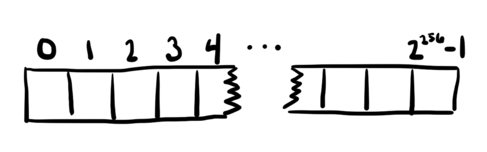
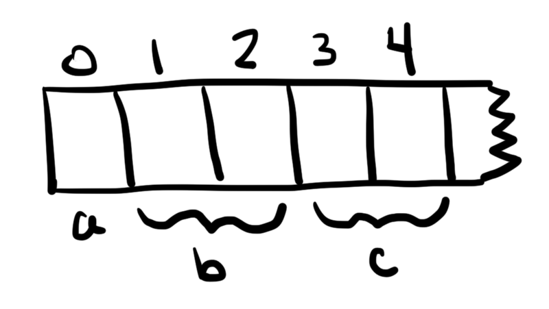
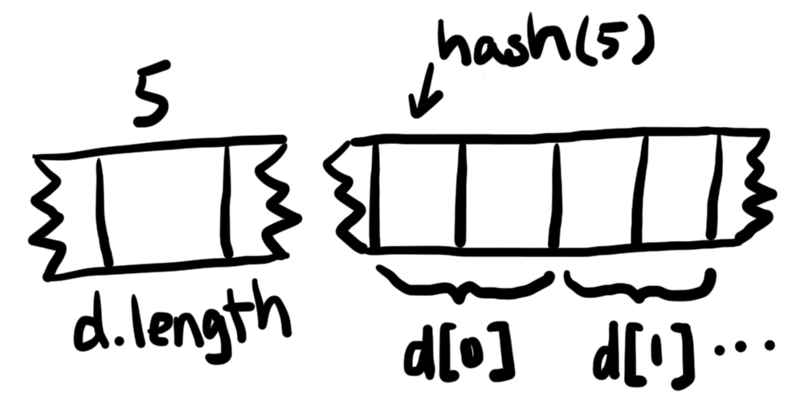
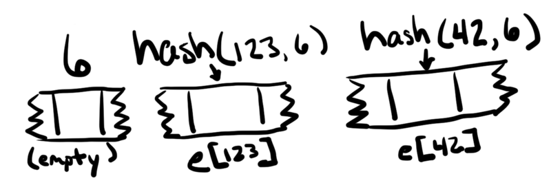

---
title:

author: bobby

reference:[https://segmentfault.com/a/1190000013791133](https://segmentfault.com/a/1190000013791133)

---

# 以太坊智能合约数据存储


以太坊智能合约使用一种不常见的存储模式，这种模式通常会让新开发人员感到困惑。在这篇文章中，将描述该存储模型并解释Solidity编程语言如何使用它。

# 一个天文数字的大数组

每个在以太坊虚拟机（EVM）中运行的智能合约的状态都在链上永久地存储着。这个存储可以被认为是每个智能合约都保存着一个非常大的数组，初始化为全0。数组中的每个值都是32字节宽，并且有2^256个这样的值。智能合约可以在任何位置读取或写入数值。这就是存储接口的大小。


我鼓励你坚持“天文数组”的思考模式，但要注意，这不是组成以太坊网络的物理计算机的实际存储方式。存储数组空间实际上非常稀疏，因为不需要存储零。将32字节密钥映射到32字节值的键/值存储将很好地完成这项工作。一个不存在的键被简单地定义为映射到零值。

由于零不占用任何空间，因此可以通过将值设置为零来回收存储空间。当您将一个值更改为零时，智能合约中内置的返还gas机制被激活。

# 定位固定大小的值

在这个存模型中，究竟是怎么样存储的呢？对于具有固定大小的已知变量，在内存中给予它们保留空间是合理的。Solidity编程语言就是这样做的。

```

contract StorageTest {
    uint256 a;
    uint256[2] b;

    struct Entry {
        uint256 id;
        uint256 value;
    }
    Entry c;
}

```

在上面的代码中：

- a存储在下标0处。(solidity表示内存中存储位置的术语是“下标（slot）”。）
- b存储在下标1和2（数组的每个元素一个）。
- c从插槽3开始并消耗两个插槽，因为该结构体Entry存储两个32字节的值。



这些下标位置是在编译时确定的，**严格基于变量出现在合同代码中的顺序。**

# 查找动态大小的值

使用保留下标的方法适用于存储固定大小的状态变量，但不适用于动态数组和映射（mapping），因为无法知道需要保留多少个槽。

如果您想将计算机RAM或硬盘驱动器作为比喻，您可能会希望有一个“分配”步骤来查找可用空间，然后执行“释放”步骤，将该空间放回可用存储池中。

但是这是不必要的，因为智能合约存储是一个天文数字级别的规模。存储器中有2^256个位置可供选择，大约是已知可观察宇宙中的原子数。您可以随意选择存储位置，而不会遇到碰撞。您选择的位置相隔太远以至于您可以在每个位置存储尽可能多的数据，而无需进入下一个位置。

当然，随机选择地点不会很有帮助，因为您无法再次查找数据。Solidity改为使用散列函数来统一并可重复计算动态大小值的位置。

# 动态大小的数组

动态数组需要一个地方来存储它的大小以及它的元素。

```

contract StorageTest {
    uint256 a;     // slot 0
    uint256[2] b;  // slots 1-2

    struct Entry {
        uint256 id;
        uint256 value;
    }
    Entry c;       // slots 3-4
    Entry[] d;
}

```

在上面的代码中，动态大小的数组d存在下标5的位置，但是存储的唯一数据是数组的大小。数组d中的值从下标的散列值hash(5)开始连续存储。



下面的Solidity函数计算动态数组元素的位置：

```

function arrLocation(uint256 slot, uint256 index, uint256 elementSize)
    public
    pure
    returns (uint256)
{
    return uint256(keccak256(slot)) + (index * elementSize);
}

```

# 映射（Mappings）

一个映射mapping需要有效的方法来找到与给定的键相对应的位置。计算键的哈希值是一个好的开始，但必须注意确保不同的mappings产生不同的位置。

```

contract StorageTest {
    uint256 a;     // slot 0
    uint256[2] b;  // slots 1-2

    struct Entry {
        uint256 id;
        uint256 value;
    }
    Entry c;       // slots 3-4
    Entry[] d;     // slot 5 for length, keccak256(5)+ for data

    mapping(uint256 => uint256) e;
    mapping(uint256 => uint256) f;
}

```

在上面的代码中，e的“位置” 是下标6，f的位置是下标7，但实际上没有任何内容存储在这些位置。（不知道多长需要存储，并且独立的值需要位于其他地方。）

要在映射中查找特定值的位置，键和映射存储的下标会一起进行哈希运算。



以下Solidity函数计算值的位置：

```

function mapLocation(uint256 slot, uint256 key) public pure returns (uint256) {
    return uint256(keccak256(key, slot));
}

```

请注意，当keccak256函数有多个参数时，在哈希运算之前先将这些参数连接在一起。由于下标和键都是哈希函数的输入，因此不同mappings之间不会发生冲突。

# 复杂类型的组合

动态大小的数组和mappings可以递归地嵌套在一起。当发生这种情况时，通过递归地应用上面定义的计算来找到值的位置。这听起来比它更复杂。

```

contract StorageTest {
    uint256 a;     // slot 0
    uint256[2] b;  // slots 1-2

    struct Entry {
        uint256 id;
        uint256 value;
    }
    Entry c;       // slots 3-4
    Entry[] d;     // slot 5 for length, keccak256(5)+ for data

    mapping(uint256 => uint256) e;    // slot 6, data at h(k . 6)
    mapping(uint256 => uint256) f;    // slot 7, data at h(k . 7)

    mapping(uint256 => uint256[]) g;  // slot 8
    mapping(uint256 => uint256)[] h;  // slot 9
}

```

要找到这些复杂类型中的项目，我们可以使用上面定义的函数。要找到g123：

```

// first find arr = g[123]
arrLoc = mapLocation(8, 123);  // g is at slot 8

// then find arr[0]
itemLoc = arrLocation(arrLoc, 0, 1);

要找到h2：

// first find map = h[2]
mapLoc = arrLocation(9, 2, 1);  // h is at slot 9

// then find map[456]
itemLoc = mapLocation(mapLoc, 456);

```

# 总结

- 每个智能合约都以2^256个32字节值的数组形式存储，全部初始化为零。
- 零没有明确存储，因此将值设置为零会回收该存储。
- Solidity中，确定占内存大小的值从第0号下标开始放。
- Solidity利用存储的稀疏性和散列输出的均匀分布来安全地定位动态大小的值。

下表显示了如何计算不同类型的存储位置。“下标”是指在编译时遇到状态变量时的下一个可用下标，而点表示二进制串联：

|        类    |	        声明         | 	  值   |                  位置               |
|     -----    |       -----         |      ----- |                -----              |
| 简单的变量     |   T v               |   v       |                v的下标              |
| 固定大小的数组 |   T[10] v            | v[n]      |       v's slot）+ n *（T的大小）     |
| 动态数组      |   T[] v              | v[n]     |  keccak256（v's slot）+ n *（T的大小）|
|              |                      | v.length |                 v的下标              |
| 映射         |   mapping(T1 => T2) v | v[key]  |      keccak256（key.（v's slot））  |


