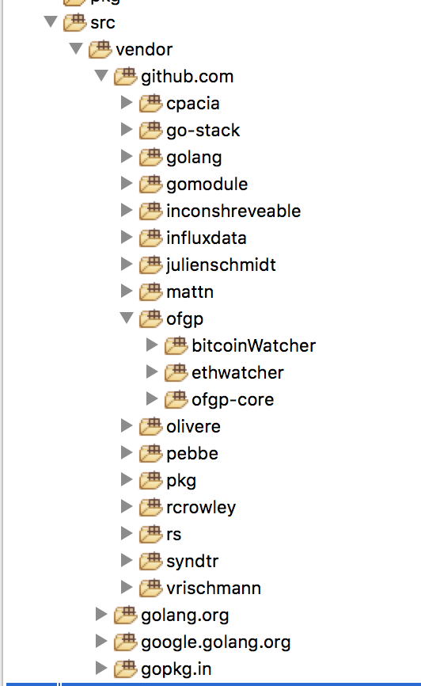

# 网关gateway安全性分析

## 物理环境安全

目前所有的生产和测试环境都只能通过跳板机登陆，首先我们登陆到跳板机然后进入到网关环境，输入`whoami`查看运行账户：

```
admin@dgateway01-prd-hz:~$ 
admin@dgateway01-prd-hz:~$ whoami
admin
admin@dgateway01-prd-hz:~$ 
admin@dgateway01-prd-hz:~$ 
```
看来是一个交admin到账户，非root账户。

使用命令`ps -ef`可以查询到进程，然后看到一个docker进程，使用命令`ps -ef | grep docker`可以看到docker相关的进程：

```
admin@dgateway01-prd-hz:~$ ps -ef | grep docker
root       681  5734  0 Sep15 ?        00:00:00 /usr/bin/docker-proxy -proto tcp -host-ip 0.0.0.0 -host-port 8162 -container-ip 172.30.0.2 -container-port 8162
root       694  5734  0 Sep15 ?        00:00:00 /usr/bin/docker-proxy -proto tcp -host-ip 0.0.0.0 -host-port 8161 -container-ip 172.30.0.2 -container-port 8161
root       706  5734  0 Sep15 ?        00:00:00 /usr/bin/docker-proxy -proto tcp -host-ip 0.0.0.0 -host-port 8160 -container-ip 172.30.0.2 -container-port 8160
root       712  5764  0 Sep15 ?        00:00:07 docker-containerd-shim -namespace moby -workdir /var/lib/docker/containerd/daemon/io.containerd.runtime.v1.linux/moby/bb4829b6201ebe34ba81f153f6baf04cdd23f023856de7861548e35dcae31a8e -address /var/run/docker/containerd/docker-containerd.sock -containerd-binary /usr/bin/docker-containerd -runtime-root /var/run/docker/runtime-runc
root      5734     1  0 Aug21 ?        00:55:17 /usr/bin/dockerd -H fd://
root      5764  5734  0 Aug21 ?        01:50:11 docker-containerd --config /var/run/docker/containerd/containerd.toml
root     13676  5734  0 Sep13 ?        00:00:00 /usr/bin/docker-proxy -proto tcp -host-ip 0.0.0.0 -host-port 8262 -container-ip 172.31.0.2 -container-port 8162
root     13688  5734  0 Sep13 ?        00:00:00 /usr/bin/docker-proxy -proto tcp -host-ip 0.0.0.0 -host-port 8261 -container-ip 172.31.0.2 -container-port 8161
root     13700  5734  0 Sep13 ?        00:00:00 /usr/bin/docker-proxy -proto tcp -host-ip 0.0.0.0 -host-port 8260 -container-ip 172.31.0.2 -container-port 8160
root     13706  5764  0 Sep13 ?        00:00:11 docker-containerd-shim -namespace moby -workdir /var/lib/docker/containerd/daemon/io.containerd.runtime.v1.linux/moby/732c8ab40059b170a444e6347585d817e9e0f98139e6444b9d6bd949621b2a6c -address /var/run/docker/containerd/docker-containerd.sock -containerd-binary /usr/bin/docker-containerd -runtime-root /var/run/docker/runtime-runc
admin    26039 25816  0 21:03 pts/0    00:00:00 grep --color=auto docker
admin@dgateway01-prd-hz:~$ 
```

按照项目组喜欢的docker方式部署环境，猜测网关服务也是使用docker方式部署，那么使用`docker ps`命令查看有那些docker容器：

```
admin@dgateway01-prd-hz:~$ 
admin@dgateway01-prd-hz:~$ docker ps 
CONTAINER ID        IMAGE                                    COMMAND                  CREATED             STATUS              PORTS                                                                    NAMES
bb4829b6201e        hub.ibitcome.com/ofgp/ofgp-core:master   "/entrypoint.sh supe…"   3 days ago          Up 3 days           0.0.0.0:8160-8162->8160-8162/tcp                                         dgateway_dgateway_1
732c8ab40059        79bc0ac8d02e                             "/entrypoint.sh supe…"   5 days ago          Up 5 days           0.0.0.0:8260->8160/tcp, 0.0.0.0:8261->8161/tcp, 0.0.0.0:8262->8162/tcp   dgateway_watch_dgateway_watch_1
admin@dgateway01-prd-hz:~$ 
admin@dgateway01-prd-hz:~$

```
看状态都是up的，那么我们进入到bb4829b6201e看看：

```
admin@dgateway01-prd-hz:~$ 
admin@dgateway01-prd-hz:~$ docker exec -it bb4829b6201e sh
/app # 
/app # 
/app # 
/app # 
```

分别使用pwd和whoami查看路径和账户：

```
/app # 
/app # 
/app # pwd
/app
/app # whoami
root
/app # 
/app #
```
ls命令查看本目录下有个`config.toml`文件，打开此文件可以看到很多相关的配置，猜测是网关的配置文件：

```
/app # cat  config.toml 
net_param = "mainnet"
# 日志级别，分别是debug, info, warn, error, critical
loglevel = "debug"

[BTC]
rpc_server = "10.6.0.62:18091"
rpc_user = "testbit"
rpc_password = "testbit"
confirm_block_num = 6
coinbase_confirm_block_num = 100
zmq_server = "tcp://10.6.0.62:18092"
[BCH]
rpc_server = "10.6.0.62:18061"
rpc_user = "testbit"
rpc_password = "testbit"
confirm_block_num = 2
coinbase_confirm_block_num = 100
zmq_server = "tcp://10.6.0.62:18062"

[LEVELDB]
btc_db_path = "/data/bitmain/leveldb_data/btc_tx_db"
bch_db_path = "/data/bitmain/leveldb_data/bch_tx_db"
ew_nonce_db_path = "/data/bitmain/leveldb_data/ew_tx_db"

[KEYSTORE]
url = "http://10.16.0.112:8976"
local_pubkey_hash = "07E4E4D527F3BAAF1766F97D0E8AA56E29CE619B"
count = 4
key_0 = "0469D105B4F77B135B4AFF403A012EE55313D6311906DCB1DFAA09F8CEC22783C26485047790B38DD82CD3A2C4C7A350ACFEDD6E846459B1A92F10D7F88B169A81"
key_1 = "048D02E3BD5834F6662CA4D6AA9AB8AF0C673B89EBA8D1B75F5B4CB2A45390FDBAB5B5BF1B24FAF6ACA9D1E8A61DA133BF7E9FABB5F0818A0B9A430C85E1B26BAA"
key_2 = "0488A4581467C55B4FF7C2FD53AAEC2CB75DF7C3162D9EECA50A1285B24CA8A56621BE384AAB1F578643152F10DA9FCF1FC07E831EB587FAA5B574DA5960A9D260"
key_3 = "04B89BED6D30B1B9B741C0E0E59D09C242B81178BAA32A3E3CC5ED2329F6797FE39D30317706DB012F603762F364E4EE11B6DC555E9A00B1DD173C8C799938D48D"
service_id = "af6764da-5609-4556-96fd-dbe66b36eb2c"
keystore_private_key = "BA0ED8D49ED25CF32D813478C82546C8BF7FE88D9E8B8502A3872AFF5862B0EC"

[DGW]
count = 4
local_id = 0
local_p2p_port = 8160
local_http_port = 8162
local_http_user = "dgateway"
local_http_pwd = "Dgatewayaf6764da"
host_0 = "118.31.12.131:8160"
status_0 = true
host_1 = "116.62.117.85:8160"
status_1 = true
host_2 = "39.106.131.157:8160"
status_2 = true
host_3 = "47.99.76.246:8160"
status_3 = true
pprof_host = ":8161"

new_node_host = ""
new_node_pubkey = ""

btc_height = 538836
bch_height = 545332
eth_height = 6226421
dbpath = "/data/bitmain/leveldb_data/node"
eth_client_url = "ws://10.16.0.109:28182"
btc_confirms = 2
bch_confirms = 2
eth_confirms = 12
confirm_tolerance = 10
eth_confirm_count = 12
# start_mode指定节点的启动方式，1是正常启动，利用配置文件里面的节点信息建立网关集群，2是加入已有网关集群, 3是以观察节点的方式启动
start_mode = 1
# init_node_host仅在mode!=1时才有意义，作为新节点的引导节点
init_node_host = ""
local_host = ""
local_pubkey = ""
check_onchain_interval = 30
check_onchain_cur = 5
#accuse 间隔单位s
accuse_interval = 180
[METRICS]
need_metrics = false
# 每隔多久上报一次
interval = 100e6
influxdb_uri = "http://127.0.0.1:8086"
db = "dgw_test"
user = ""
password = ""

[ETHWATCHER]
vote_contract = "0xd9C422D2205248E7ec4D4C21A6b270BAA66784C0"

[BUS]
# 铸币和熔币的手续费比例，除以一万，目前都是0
mint_fee_rate = 0
burn_fee_rate = 0
min_bch_mint_amount = 1000000
min_btc_mint_amount = 1000000
min_burn_amount = 1000000
/app # 
```
继续查看，可以在/go目录下看到三个文件夹：

```
/go # 
/go # ls
bin  pkg  src
/go # 
/go #
```
这里的bin文件就是存放的网关编译后的文件，src存放的是网关的源代码。

网关相关的代码在github：`https://github.com/ofgp`。将网关代码下载后会发现很多应用都没有源码，这个时候用glide下载全套都源码。



