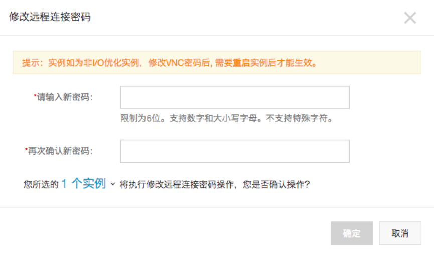

# Key Mangement安全部署

# 1	Key Mangement安全部署简述

Key Management安全部署文档主要针对于Key Management服务的部署上线阶段，帮助运维人员正确、安全的完成Key Management服务部署上线，并最终保证Key Management在上线运行和运维的整体安全性。

## 目的介绍

本文档是给运维人员提供Key Management服务安装和配置的安全指导，帮助运维人员能够快速的安装和配置Key Management服务，确保Key Management服务服务安全运行和安全运维。

## 使用对象

本规范的读者及使用对象主要为Key Management相关的运维人员。

## 实现目标

- 确保Key Management服务基础环境和应用程序安全运行。
- 确保Key Management服务降低遭受网络攻击和信息泄露事件。

# Key Management部署

注意：安装本服务的各项组件之前，假定已有操作系统和网络安全设备（包括防火墙、WAF、IPS、IDS等），并且部署完成。且有操作系统和网络安全设备相对应的安全部署文档。

## 系统结构图


## 部署方式

本服务采用阿里云服务器托管方式进行部署。

1、	基础环境采用阿里云服务器+Ubuntu操作系统。
2、	Key Management服务需要的mongo DB、mysql、应用程序均采用docker方式部署。

## 服务运行环境要求

### 硬件环境要求

服务器硬件要求：  
CPU：XXX以上  
内存：XXXG以上  
硬盘：自由空间XXXG以上  

### 软件环境要求

服务器软件要求：  
操作系统：Ubuntu 16.04 64位  
Java：1.8版本  
mysql：5.7版本  
Mongo DB：4.0.0版本  

## 操作系统部署

本章节主要描述基础环境基于阿里云服务器和Ubuntu16.04镜像文件的获取、安装、部署。

### 操作系统部署

根据阿里云登陆后申购ECS的步骤详细说明。

#### 购买和配置ECS

请根据项目实际需要购买和配置ECS服务器，镜像版本选择Ubuntu 16.04 64位版本，同时需要勾选安全加固配置选项。


在购买云服务器后，需要修改远程连接密码和root账号密码，具体操作入下图所示：

进入到购买到云服务ECS实例后，点击更加可以看到密码/密钥选项：


点击重置密码选项可以重置云服务器的root账号密码：


>**注意：** 密码复杂度需要按照阿里云要求提交。
>点击修改远程连接密码进行修改远程连接密码：



>**注意：** 密码复杂度需要按照阿里云要求提交。
密码管理参考密码保管章节处理。

### 操作系统加固

##### 密码口令复杂度设置

设置可使用pam pam_cracklib module或pam_passwdqc module实现密码复杂度设置。PS：两者不能同时使用。

```

pam_cracklib主要参数:
dcredit = N：数组个数。（N >= 0密码中最多有几个数字，N < 0密码中最少有多少个数字）
lcredit = N：小写字母个数。
ucredit = N：大写字母个数。
credit = N：特殊字符个数。
minclass = N：密码由几种类型字符组成。（大/小写字母；数字；特殊字符）
minlen = N：新密码最短长度。
difok = N：新密码必须与旧密码不同的位数。
tretry = N：重试多少次后返回密码修改错误。
pam_passwdqc参数本次没有使用，了解请度娘。

```

**加固步骤：**

1、安装PAM的cracklib模块
```
root@ubuntu:/# apt-get install libpam-cracklib
```
2、执行备份
```
root@ubuntu:/# cp -p /etc/pam.d/common-password /etc/pam.d/common-password.bak
```
3、修改策略设置
```
root@ubuntu:/# vim /etc/pam.d/common-password
```
如设置为至少一个大写字母，一个小写字母，一个数字和一个标点；密码最小长度为8；修改重试3次；不同位数3个；密码最少由两种字符组成；
则修改或加入 ` password requisite pam_cracklib.so ucredit=-1 lcredit=-1 dcredit=-1 ocredit=-1 retry=3 minlen=8 difok=3 minclass = 2 ` 

#### 禁止使用旧密码

**加固步骤：**

1、执行备份
```
root@ubuntu:/# cp -p /etc/pam.d/common-password /etc/pam.d/common-password.bak
```
2、创建文件/etc/security/opasswd，并设置权限
```
root@ubuntu:/# touch /etc/security/opasswd
root@ubuntu:/# chown root:root /etc/security/opasswd
root@ubuntu:/# chmod 600 /etc/security/opasswd
```
3、修改策略设置
```
root@ubuntu:/# vim /etc/pam.d/common-passwd
```
在 ` password required pam_unix.so ` 所在行增加remember=5，保存退出。设置为禁止使用最近使用过的5个密码。

#### 密码口令生存周期

**加固步骤：**

1、执行备份
```
root@ubuntu:/# cp -p /etc/login.defs /etc/login.defs.bak
```
2、修改策略设置
```
root@ubuntu:/# vim /etc/login.defs
```
修改
```
PASS_MAX_DAYS 90 #有效期设置为90天，如是99999则为永不过期。
PASS_MIN_DAYS 0 #是否可修改密码，0可修改，否则几天后可修改。
PASS_MIN_LEN 0 #密码最小长度，设置后cracklib module后该参数失效。
PASS_WARN_AGE 7 #密码失效期前几天提示修改。
```
1.1.1.4	设置登录超时

**加固步骤：**

1、执行备份
```
root@ubuntu:/# cp -p /etc/profile /etc/profile.bak
```
2、修改策略设置
```
root@ubuntu:/# vim /etc/profile
```
在末行加入 ` MOUT=180;export `  ，保存退出。
>**注：** 在密码修改的过程中，密码策略会立即生效。如发现开机密码口令验证失败的情况，请移步：[http://blog.csdn.net/ljgstudy/article/details/38828633](http://blog.csdn.net/ljgstudy/article/details/38828633)

#### 删除UID为0的非root用户

**加固步骤：**

1、执行备份
```
root@ubuntu:/# cp –p /etc/passwd /etc/passwd.bak
root@ubuntu:/# cp –p /etc/shadow /etc/shadow.bak
root@ubuntu:/# cp –p /etc/group /etc/group.bak
```
2、执行命令删除UID为0的用户
```
root@ubuntu:/# userdel username
```
注： ` /etc/passwd ` 文件中第三列为0的用户只能为root用户。

#### 限制用户su

限制能su到root的用户。

**加固步骤：**

使用命令 ` vi /etc/pam.d/su ` 修改配置文件，在配置文件中添加行。例如，只允许test组用户su到root，则添加 ` auth required pam_wheel.so group=test ` 。

#### 文件账号权限设置

条件：用root外的其它帐户登录，对重要文件和目录进行删除、修改等操作不能够成功即为符合。

**加固步骤：**

1、将文件权限设置为 ` /etc/passwd ` 权限为644，` /etc/shadow ` 权限为400，` /etc/group ` 权限为644。

2、执行命令
```
root@ubuntu:/# chmod 644 /etc/passwd
root@ubuntu:/# chmod 400 /etc/shadow
root@ubuntu:/# chmod 644 /etc/group
```
#### 文件系统设置umask值

设置默认的umask值，增强安全性。

**加固步骤：**

使用命令 ` vi /etc/profile ` 修改配置文件，添加行 ` umask 027 ` ， 即新创建的文件属主拥有读写执行权限，同组用户拥有读和执行权限，其他用户无权限。

#### 删除和锁定无关账号

**加固步骤：**

1、执行备份
```
root@ubuntu:/# cp -p /etc/passwd /etc/passwd.bak
root@ubuntu:/# cp -p /etc/shadow /etc/shadow.bak
```
2、锁定无关帐户：
方法一：
```
root@ubuntu:/# vim /etc/shadow
```
在需要锁定的用户名的密码字段前面加!，如 ` test:!$1$QD1ju03H$LbV4vdBbpw.MY0hZ2D/Im1:14805:0:99999:7::: ` 
方法二：
```
root@ubuntu:/# passwd -l test
```
3、将/etc/passwd文件中的shell域设置成/bin/false。

>**注：** 主要操作一些帐户不存在或者它们的密码字段为!!用户。

#### 禁止icmp重定向

**加固步骤：**

1、备份文件：
```
root@ubuntu:/# cp -p /etc/sysctl.conf /etc/sysctl.conf.bak
```
2、执行：
```
root@ubuntu:/# vim /etc/sysctl.conf

加上net.ipv4.conf.all.accept_redirects=0
也可以用以下命令修改net.ipv4.conf.all.accept_redirects的值为0
sysctl -w net.ipv4.conf.all.accept_redirects=0
```

#### 主机SSH访问控制（IP限制）

**加固步骤：**

1、执行备份：
```
root@ubuntu:/# cp -p /etc/hosts.allow /etc/hosts.allow.bak
root@ubuntu:/# cp -p /etc/hosts.deny /etc/hosts.deny.bak
```
2、编辑/etc/hosts.allow和/etc/hosts.deny两个文件，文件的配置格式为：
```
Service:host [or network/netmask],host [or network/netmask]
root@ubuntu:/# vim /etc/hosts.allow
```
增加一行 service: 允许访问的IP，举例如下：
```
all:192.168.4.44:allow #允许单个IP访问所有服务进程
sshd:192.168.1.:allow #允许192.168.1的整个网段访问SSH服务进程
root@ubuntu:/# vim /etc/hosts.deny
```
增加一行 ` sshd:all:DENY ` 当设置了 ` hosts.allow ` 之后 ` hosts.deny ` 不再起作用。

#### 启用日志

##### syslogd日志

启用日志功能，并配置日志记录。

**加固步骤：**

Linux系统默认启用以下类型日志：

```
    系统日志（默认）/var/log/messages
    cron日志（默认）/var/log/cron
    安全日志（默认）/var/log/secure
```
注意：部分系统可能使用syslog-ng日志，配置文件为： ` /etc/syslog-ng/syslog-ng.conf ` 。
可以根据需求配置详细日志。

##### 记录所有用户的登录和操作日志

通过脚本代码实现记录所有用户的登录操作日志，防止出现安全事件后无据可查。

**加固步骤：**

    运行 [root@ubuntu /]# vim /etc/profile打开配置文件。
在配置文件中输入以下内容：

```
history
    USER=`whoami`
    USER_IP=`who -u am i 2>/dev/null| awk '{print $NF}'|sed -e 's/[()]//g'`
    if [ "$USER_IP" = "" ]; then
    USER_IP=`hostname`
    fi
    if [ ! -d /var/log/history ]; then
    mkdir /var/log/history
    chmod 777 /var/log/history
     fi
     if [ ! -d /var/log/history/${LOGNAME} ]; then
     mkdir /var/log/history/${LOGNAME}
     chmod 300 /var/log/history/${LOGNAME}
     fi
     export HISTSIZE=4096
     DT=`date +"%Y%m%d_%H:%M:%S"`
    export HISTFILE="/var/log/history/${LOGNAME}/${USER}@${USER_IP}_$DT"
    chmod 600 /var/log/history/${LOGNAME}/*history* 2>/dev/null
    运行 [root@ubuntu /]# source /etc/profile 加载配置生效。
```

    注意：` /var/log/history ` 是记录日志的存放位置，可以自定义。
通过上述步骤，可以在 ` /var/log/history ` 目录下以每个用户为名新建一个文件夹，每次用户退出后都会产生以用户名、登录IP、时间的日志文件，包含此用户本次的所有操作（root用户除外）。
同时，建议使用OSS服务收集存储日志。

#### 配置远程日志保存

**加固步骤：**

1、执行备份：
```

root@ubuntu:/# cp -p /etc/rsyslog.d/50-default.conf /etc/ rsyslog.d/50-default.conf.bak
```

2、修改50-default.conf文件

```
root@ubuntu:/# vim / etc/rsyslog.d/50-default.conf
新增. @192.168.0.1 行，192.168.0.1为远程日志服务器ip
root@ubuntu:/# /etc/init.d/rsyslog restart
```
#### 使用内置防火墙iptables来过滤流量

**加固步骤：**

方法一：
1、查看iptables的状态
```
root@ubuntu:/# iptables-save
2、增加iptables访问控制策略
root@ubuntu:/# iptables -A INPUT -p tcp -dport 22 -m state --state NEW -j ACCEPT
root@ubuntu:/# iptables -A INPUT -m state -state RELATE,ESTABLISTED -j ACCEPT
root@ubuntu:/# iptables -A INPUT -j DROP
```
以上策略为只允许远程主机主动访问服务器ssh端口，而服务器可以主动向外访问所有端口。
方法二：
由于加固过程中按照方法一老是会出现问题，参数也比较复杂，下面可以使用一个小工具ufw来调用iptables来设置；
1、启用ufw
```
root@ubuntu:/# ufw default deny
root@ubuntu:/# ufw enable
```
2、开启/禁用
```
ufw allow|deny [service]
```
打开或关闭某个端口，例如：

```
root@ubuntu:/# ufw allow smtp　#允许所有的外部IP访问本机的25/tcp (smtp)端口
root@ubuntu:/# ufw allow 22/tcp #允许所有的外部IP访问本机的22/tcp (ssh)端口
root@ubuntu:/# ufw allow 222 #允许所有的外部IP访问本机的222(tcp/udp)
root@ubuntu:/# ufw allow 9080 #允许外部访问9080端口(tcp/udp)
root@ubuntu:/# ufw deny smtp #禁止外部访问smtp服务
root@ubuntu:/# ufw delete allow smtp #删除上面建立的某条规则

```

3、查看防火墙状态

```
root@ubuntu:/# ufw status
```
4、关闭ufw
```
root@ubuntu:/# ufw disable
```

#### 禁止root远程登录

**加固步骤：**

1、修改sshd_config文件
```
root@ubuntu:/# vim /etc/ssh/sshd_config

将默认访问端口22,修改为Port 222
将SSH协议改为SSH2,修改为Protocol 2
将PermitRootLogin yes改为PermitRootLogin no ,禁止root远程登录。
将RSAAuthentication yes改为RSAAuthentication no,关闭RSA密钥验证,此验证只针对SSH1。(sshd_config/ssh_config)
将UseDNS yes改为UseDNS no,不使用DNS反向解析。
如需设置部分用户通过ssh登录,可在文件中加入AllowUsers user1 user2(user1 user2 为用户名)。
```

2、查看securetty文件
```
root@ubuntu:/# more /etc/securetty
```
是否有下列行pts/x(x为一个十进制整数),不存在pts/x则禁止了telnet登录,存在将其所在行注释#。
3、重启ssh生效
```
root@ubuntu:/# sevice ssh restart
```

#### 设置远程登录时提示信息

**加固步骤：**

1、执行如下命令创建banner信息文件

```
root@ubuntu:/# touch /etc/sshbanner
root@ubuntu:/# chown bin:bin /etc/sshbanner
root@ubuntu:/# chmod 644 /etc/sshbanner
root@ubuntu:/# echo "Authorized users only. All activity may be monitored and reported!" >/etc/sshbanner

```
2、修改 ` /etc/ssh/sshd_config ` 文件, 将 ` #Bannder /etc/sshbanner ` 前#去掉。
或直接在文件末尾添加Bannder /etc/sshbanner。
3、重启ssh生效

```
root@ubuntu:/# sevice ssh restart
```

#### 口令锁定策略

**加固步骤：**

1、执行备份:
```
root@ubuntu:/# cp -p /etc/pam.d/common-auth /etc/pam.d/common-auth.bak
```
2、修改策略设置:
```
root@ubuntu:/# vim /etc/pam.d/common-auth
```
增加 ` auth requisite pam_tally2.so deny=5 onerr=fail even_deny_root unlock_time=100 root_unlock_time=150 ` 到第二行,保存退出。


#### 关闭不必要的服务

关闭不必要的服务（如普通服务和xinetd服务），降低风险。

**加固步骤：**

使用命令 ` systemctl disable <服务名> ` 设置服务在开机时不自动启动。

说明： 对于部分老版本的Linux操作系统，可以使用命令 ` chkconfig --level <init级别> <服务名> off ` 设置服务在指定init级别下开机时不自动启动。

#### 关闭不必要的端口

为了防止被nmap等扫描工具扫描到开放端口，操作系统仅开发功能所需要必须的端口，其余端口需要关闭。

**加固步骤：**

使用命令 ` “netstat -ano” ` 查看当前端口开放的状态使用命令 ` “netstat -ano” ` 查看当前端口开放的状态，筛选出需要关闭的短号列表。具体的关闭端口方式有如下三种：
1、通过杀掉进程的方法来关闭端口
每个端口都有一个守护进程，kill掉这个守护进程就可以了
每个端口都是一个进程占用着，
第一步、用下面命令
```
netstat -anp |grep 端口
```
找出占用这个端口的进程，
第二步、用下面命令
```
kill -9 PID
```
杀掉就行了

2、通过开启关闭服务的方法来开启/关闭端口

因为每个端口都有对应的服务，因此要关闭端口只要关闭相应的服务就可以了。
linux中开机自动启动的服务一般都存放在两个地方：

 ` /etc/init.d/ ` 文件夹下的服务：

这个文件夹下的服务都可以通过运行相应的SCRIPT来启动或关闭。
例如：启动sendmail服务： ` ./sendmail start (打开了TCP 25端口) ` 
关闭sendmail服务： ` ./sendmail stop （关闭TCP 25 端口） ` 
查看sendmail服务当前状态：  ` ./sendmail? status ` （查看服务是否运行）
```
/etc/xinetd.d/文件夹下的服务：
```
这个文件夹下的服务需要通过更改服务的配置文件，并重新启动xinetd才可以。
例如：要启动其中的auth服务，打开 ` /etc/xinetd.d/auth ` 配置文件，更改“disable=no”，保存退出。
运行 ` /etc/rc.d/init.d/xinetd restart ` 
要停止其中的auth服务，打开 ` /etc/xinetd.d/auth ` 配置文件，更改“disable=yes”，保存退出。
运行 ` /etc/rc.d/init.d/xinetd restart ` 
3、通过防火墙限制端口
以下介绍的方法在Linux命令下使用，很简便。
开端口为：
```
iptables -A INPUT -p   $port   -j ACCEPT
```
关把ACCEPT改为DROP即可，即：
```
iptables -A INPUT -p $port   -j DROP
```
其中$port即为端口数字。

## 应用程序安装部署

本章节主要描述使用docker方式部署安装mysql、mongo DB、Key Management服务应用程序。

### 安装docker

本章节主要描述在阿里云的Ubuntu操作系统上面安装docker。如果阿里云的Ubuntu自带docker，请查看版本后更新到最新版本。以下为Ubuntu 16.04安装docker安装步骤，请实际操作后截图：
Ubuntu 16.04 (使用apt-get进行安装) 安装docker步骤：

**前提条件：**

Docker 要求 Ubuntu 系统的内核版本高于 3.10 ，查看本页面的前提条件来验证你的 Ubuntu 版本是否支持 Docker。
通过 uname -r 命令查看你当前的内核版本


**step 1: 由于apt官方库里的docker版本可能比较旧，所以先卸载可能存在的旧版本（全新安装时，无需执行该步骤）**
```
sudo apt-get remove docker docker-engine docker-ce docker.io
```


**step 2: 更新系统软件（更新apt包索引）**                                                                                                       

```
sudo apt-get update
```


**step 3: 安装以下包以使apt可以通过HTTPS使用存储库（repository） **

```
sudo apt-get -y install apt-transport-https ca-certificates curl software-properties-common
```


**step 4: 添加Docker官方的GPG密钥**

>执行该命令时，如遇到长时间没有响应说明网络连接不到docker网站，需要使用代理进行。 
```                                                                                                          
//curl -fsSL http://mirrors.aliyun.com/docker-ce/linux/ubuntu/gpg | sudo apt-key add - 使用阿里云的密钥
curl -fsSL https://download.docker.com/linux/ubuntu/gpg | sudo apt-key add -
```


**Step 5: 添加仓库**

```
//sudo add-apt-repository "deb [arch=amd64] http://mirrors.aliyun.com/docker-ce/linux/ubuntu $(lsb_release -cs) stable"   使用阿里云仓库
sudo add-apt-repository "deb [arch=amd64] https://download.docker.com/linux/ubuntu $(lsb_release -cs) stable"  
```


**Step 6: 更新系统软件（更新apt包索引）**

经实践，这一步不能够省略，我们需要再次把软件更新到最新，否则下一步有可能会报错。
```
sudo apt-get update
```


***Step 7: 如果想指定安装某一版本，可使用 sudo apt-get install docker-ce= `<VERSION> ` 命令，把 `<VERSION> `替换为具体版本即可。**

以下命令没有指定版本，默认就会安装最新版。      

```
sudo apt-get  install docker-ce

```


安装指定版本的Docker-CE:

- Step 1: 查找Docker-CE的版本:

```
apt-cache madison docker-ce                                                                                               
docker-ce | 17.03.1~ce-0~ubuntu-xenial | http://mirrors.aliyun.com/docker-ce/linux/ubuntu xenial/stable amd64 Packages  
docker-ce | 17.03.0~ce-0~ubuntu-xenial | http://mirrors.aliyun.com/docker-ce/linux/ubuntu xenial/stable amd64 Packages
```


- Step 2: 安装指定版本的Docker-CE: (VERSION例如上面的17.03.1~ce-0~ubuntu-xenial)


```

sudo apt-get -y install docker-ce=[VERSION]
```


安装完成后使用docker info或者docker –v验证是否安装成功。


**Step 8:查看docker版本**

```
docker -v
```


**Step 9:验证docker**

a)	查看docker服务是否启动：
```
systemctl status docker
```


a)	若未启动，则启动docker服务：

```
sudo systemctl start docker
```

b)	经典的hello world：
```
sudo docker run hello-world
```


有以上输出则证明docker已安装成功！

### 安装mysql

#### docker方式安装mysql

如果直接从镜像仓库获取mysql镜像文件，从安全和兼容性角度出发获取mysql5.7版本的镜像文件。

如果是通过Dockerfile构建镜像的方式制作mysql镜像，请在安装成功mysql后按照mysql安全配置加固后再制作镜像文件。

请按照docker方式安装mysql步骤一步步详细描述和截图。

##### 搜索可使用的mysql镜像

使用命令docker search mysql查找Docker Hub上的mysql镜像：


##### 获取镜像文件

使用命令 ` docker pull mysql:5.7 ` 从docker官方镜像下载mysql：


>**注意:mysql后面如果不指定tag即版本号，例如docker pull mysql，默认将会拉取官方镜像mysql的最新版本latest，等价于docker pull mysql:latest。**

也可以从docker官方镜像网站[https://hub.docker.com/_/mysql/](https://hub.docker.com/_/mysql/)查看mysql版本：


可以看到mysql目前在docker官方镜像上最新版本为8.0.11即latest版本。本次兼顾安全性和兼容性所以采用mysql5.7版本。

等待下载完成后，我们就可以在本地镜像列表里查到REPOSITORY为mysql,标签为5.7的镜像。

```
docker images |grep mysql
```


##### 启动mysql容器

通过命令 ` docker run [OPTIONS] IMAGE [COMMAND] [ARG...] [flags] ` 启动一个mysql容器，mysql容器的安全配置参考mysql安全配置章节。涉及到修改mysql配置文件，修改mysql配置文件有两种方法：

- 一是进入容器，修改容器里的MySQL的配置文件，然后重新启动容器，例如：

```
sudo docker exec -it pwc-mysql /usr/bin/bash
```

然后可以进入容器的命令行模式，接着修改 ` /etc/mysql/my.cnf ` 文件即可

- 二是挂载主机的mysql配置文件，官方文档如下：
```
The MySQL startup configuration is specified in the file /etc/mysql/my.cnf, and that file in turn includes any files found in the /etc/mysql/conf.d directory that end with .cnf. Settings in files in this directory will augment and/or override settings in /etc/mysql/my.cnf. If you want to use a customized MySQL configuration, you can create your alternative configuration file in a directory on the host machine and then mount that directory location as /etc/mysql/conf.d inside the mysql container.

If /my/custom/config-file.cnf is the path and name of your custom configuration file, you can start your mysql container like this (note that only the directory path of the custom config file is used in this command):
 	docker run --name some-mysql -v /my/custom:/etc/mysql/conf.d -e MYSQL_ROOT_PASSWORD=my-secret-pw -d mysql:tag

This will start a new container some-mysql where the MySQL instance uses the combined startup settings from /etc/mysql/my.cnf and /etc/mysql/conf.d/config-file.cnf, with settings from the latter taking precedence.
```

##### 数据和配置挂载到宿主机

为了安全性，我们应该将数据和配置放到宿主机中，在创建好项目目录和配置文件后通过 ` docker run –v ` 参数指定挂载目录和配置文件。


#### mysql安全配置

##### 默认端口修改

1、可以直接通过在 ` /etc/my.cnf ` 中设置： 

```
port = 3306 修改为非常规端口如：port = 36660
```
说明：如果说使用docker安装mysql容器，在使用docker run运行mysql容器的时候，使用如下命令：

```
docker run  --name mymysql -v /home/mysql/my.cnf:/etc/mysql/my.cnf  -e MYSQL_ROOT_PASSWORD=123456 -d mysql:5.7
```
即采用-v参数将宿主机的 ` /home/mysql/my.cnf ` 挂载到容器的 ` /etc/mysql/my.cnf ` 。

` /home/mysql/my.cnf ` 的配置如下：

```
[mysqld]
port=33060 //	根据项目需要做实际调整
```
2、重新启动mysql服务。

对mysql端口的修改可以从一定程度上防止端口扫描工具的扫描。

##### 账号安全

1、	禁止 Mysql 以管理员帐号权限运行
以普通帐户安全运行 mysqld，禁止以管理员帐号权限运行 MySQL 服务。在 ` /etc/my.cnf ` 配置文件中进行以下设置。
   
```
[mysql.server]
user=mysql
```
2、	避免不同用户间共享帐号

参考以下步骤：
a)	创建用户

```
mysql> mysql> insert into
mysql.user(Host,User,Password,ssl_cipher,x509_issuer,x509_subject) values("localhost","pppadmin",password("passwd"),'','','');
```       
执行以上命令可以创建一个 phplamp 用户。

b)	使用该用户登录 MySQL 服务

```
mysql>exit; 
@>mysql -u phplamp -p 
@>输入密码 
mysql>登录成功
```

3、	删除无关帐号
` DROP USER ` 语句可用于删除一个或多个 MySQL 账户。使用 ` DROP USER ` 命令时，必须确保当前账号拥有 MySQL 数据库的全局 ` CREATE USER ` 权限或 ` DELETE ` 权限。账户名称的用户和主机部分分别与用户表记录的 User 和 Host 列值相对应。
执行 ` DROP USER user ` ;语句，可以取消一个账户和其权限，并删除来自所有授权表的帐户权限记录。

##### 口令安全

检查账户默认密码和弱密码。口令长度需要至少八位，并包括数字、小写字母、大写字母和特殊符号四类中的至少两种类型，且五次以内不得设置相同的口令。密码应至少每 90 天进行一次更换。口令复杂度要求具体可以参考附件1：口令安全要求的口令复杂度。

可以通过执行以下命令修改密码。

```
mysql> update user set authentication_string=PASSWORD("123456") where user='root';
mysql> FLUSH PRIVILEGES;
```

>**注意：采用docker方式创建mysql容器，由于docker保存的配置文件为明文，为了避免root密码被泄露，` docker run ` 命令的-e参数选用 ` MYSQL_ALLOW_EMPTY_PASSWORD=true ` ，而不能直接选择` ` ` MYSQL_ROOT_PASSWORD=123456 ` 和 ` MYSQL_RANDOM_ROOT_PASSWORD ` 。如果选用 ` MYSQL_ROOT_PASSWORD ` ，将会在docker里面的容器配置文件里面可以看到root账号密码，如果是选择 ` MYSQL_RANDOM_ROOT_PASSWORD `，可以通过命令 ` docker logs containerName ` 查看到随机密码，例如 ` GENERATED ROOT PASSWORD: eim7oo0zuxohK2eij6gahthaporu8Wo0 `。**

因此可以采用如下-e参数启动mysql容器：
```
docker run --name bobby -e MYSQL_ALLOW_EMPTY_PASSWORD=true -d mysql:5.7
```

在创建成功mysql容器后，必须进入到mysql数据库使用正常的修改密码命令为root账号设置密码。

##### 授权安全

在数据库权限配置能力范围内，根据用户的业务需要，配置其所需的最小权限。

1、	查看数据库授权情况

```
mysql> use mysql;
mysql> select * from user;
mysql>select * from db;
mysql>select * from host;
mysql>select * from tables_priv;
mysql>select * from columns_priv;
        
```

2、	通过 revoke 命令回收不必要的或危险的授权

```
mysql> help revoke
Name: 'REVOKE'
Description:
Syntax:
REVOKE
priv_type [(column_list)]
   [, priv_type [(column_list)]] ...
 ON [object_type]
     {
         *
       | *.*
       | db_name.*
       | db_name.tbl_name
       | tbl_name
       | db_name.routine_name
     }
 FROM user [, user] ...
```

         
##### 开启日志审计功能

数据库应配置日志功能，便于记录运行状况和操作行为。
MySQL服务有以下几种日志类型：

- 错误日志： -log-err
- 查询日志： -log （可选）
- 慢查询日志： -log-slow-queries （可选）
- 更新日志： -log-update
- 二进制日志： -log-bin

找到 MySQL 的安装目录，在/etc/mysql/my.cnf配置文件中增加上述所需的日志类型参数，保存配置文件后，重启 MySQL 服务即可启用日志功能。例如：

```
#Enter a name for the binary log. Otherwise a default name will be used. 
#log-bin= 
#Enter a name for the query log file. Otherwise a default name will be used. 
#log= 
#Enter a name for the error log file. Otherwise a default name will be used. 
log-error= 
#Enter a name for the update log file. Otherwise a default name will be used. 
#log-update=
```

该参数中启用错误日志。如果您需要启用其他的日志，只需把对应参数前面的 “#” 删除即可。

日志查询操作说明

* 执行show variables like 'log_%';命令可查看所有的 log。
* 执行show variables like 'log_bin';命令可查看具体的 log。

##### 安装最新补丁

确保系统安装了最新的安全补丁。
注意： 在保证业务及网络安全的前提下，并经过兼容性测试后，安装更新补丁。安全警报和补丁下载网址是[http://www.mysql.com](http://www.mysql.com)。

##### 如果不需要，应禁止远程访问


禁止网络连接，防止猜解密码攻击、溢出攻击、和嗅探攻击。
>**注意： 仅限于应用和数据库在同一台主机的情况。
如果数据库不需要远程访问，可以禁止远程 TCP/IP 连接，通过在 MySQL 服务器的启动参数中添加 ` --skip-networking ` 参数使 MySQL 服务不监听任何 TCP/IP 连接，增加安全性。**

```
iptables -P INPUT DROP
iptables -P FORWARD DROP
iptables -P OUTPUT DROP
iptables -I INPUT -p tcp --dport 33660 -j DROP
```

#只允许内部的服务器访问mysql数据库

```
iptables -I INPUT -s 192.168.1.123 -ptcp --dport 33660 -j ACCEPT
iptables -I INPUT -s 192.168.1.124 -ptcp --dport 33660 -j ACCEPT
service iptables save
```

#从数据库服务器网络隔离

```
iptables -P INPUT DROP
iptables -P FORWARD DROP
iptables -P OUTPUT DROP
iptables -I INPUT -p tcp --dport 33660 -j DROP
```
#只允许内部的mysq主服务器访问

```
iptables -I INPUT -s 192.168.1.121 -ptcp --dport 33660 -j ACCEPT
service iptables save
```

##### 设置可信 IP 访问控制

通过数据库所在操作系统的防火墙限制，实现只有信任的 IP 才能通过监听器访问数据库。

```
mysql> GRANT ALL PRIVILEGES ON db.*
·-> -> TO 用户名@'IP子网/掩码';
```
     
##### 连接数设置

根据您的机器性能和业务需求，设置最大、最小连接数。

在 MySQL 配置文件`（my.conf）` 的 ` [mysqld] ` 配置段中添加 ` max_connections = 1000 ` ，保存配置文件，重启 MySQL 服务后即可生效。


### 安装mongo DB

#### docker方式安装mongo DB

如果直接从镜像仓库获取mongo DB镜像文件，从安全和兼容性角度出发获取mongo 4.0.0版本的镜像文件。

如果是通过Dockerfile构建镜像的方式制作mongo镜像，请在安装成功mongo后按照mongo安全配置加固后再制作镜像文件。

请按照docker方式安装mongo步骤一步步详细描述和截图。
    
##### 搜索可使用的mysql镜像

使用命令docker search mongo查找Docker Hub上的mongo镜像：


##### 获取镜像文件

使用命令 ` docker pull mongo:4.0 ` 从docker官方镜像下载mongo：


>**注意，mysql后面如果不指定tag即版本号，例如 ` docker pull mongo ` ，默认将会拉取官方镜像mysql的最新版本latest，等价于 ` docker pull mongo:latest ` 。**

我也可以从docker官方镜像网站[https://hub.docker.com/_/mongo/](https://hub.docker.com/_/mongo/)查看mongo版本：


可以看到mysql目前在docker官方镜像上最新版本为4.0.0即latest版本。本次兼顾安全性和兼容性所以采用mysql4.0版本。

等待下载完成后，我们就可以在本地镜像列表里查到REPOSITORY为mongo，标签为4.0的镜像。

```
docker images |grep mongo
```


##### 启动mongo DB容器

通过命令 ` docker run [OPTIONS] IMAGE [COMMAND] [ARG...] [flags] ` 启动一个mongo容器，mongo容器的安全配置参考mongo DB安全配置章节。

##### 数据和配置挂载到宿主机

为了安全性，我们应该将数据和配置放到宿主机中，在创建好项目目录和配置文件后通过 ` docker run –v ` 参数指定挂载目录和配置文件。

- 指定MongoDB配置文件

当我们需要修改配置文件时，我们只需要在宿主机上创建一个 ` mongodb.conf ` 文件，并将该文件所在的文件夹映射到容器的 ` /data/configdb ` 文件夹中，同时，在容器的启动命令中添加 ` --config ` 参数即可。例如：

```
docker run --name mymongo -v /home/mongo/etc/mongo.conf:/data/configdb/mongo.conf   -d mongo:4.0 --config /data/configdb/mongo.conf
```

注意：mongodb的配置文件中的 ` bind_ip ` 默认为 ` 127.0.0.1 ` ，默认只有本机可以连接。  此时，需要将 ` bind_ip ` 配置为 ` 0.0.0.0 ` ，表示接受任何IP的连接。

- 数据持久化

在使用MongoDB的容器时，数据持久化有很多种方式，下面我们将描述一种推荐的方式： 
在宿主机上创建一个数据存储目录，并将其映射到容器中的目录中。这将数据库文件放在主机系统中的已知位置，并便于主机系统上的工具和应用程序访问文件。缺点是用户需要确保目录存在，例如，主机系统上的目录权限和其他安全机制配置正确。 
使用方法如下：
在宿主机中创建一个目录，例如 ` /home/mongo/data ` 。如下命令启动容器： 

```
docker run --name mymongo -v /home/mongo/data:/data/db  -d mongo:4.0 
```

- 数据库授权

默认情况下，Mongo数据库没有添加认证约束，也就是说任何人只要知道数据库服务的地址和端口，就可以正常访问数据库并对数据库进行增删改查。为了增强数据库的安全性，我们需要对数据库添加授权认证。 
添加方式如下：

在启动数据库容器命令中添加--auth参数。 
```
docker run --name some-mongo -d mongo --auth
```    
使用exec命令进入命令行，并添加用户名和密码。 
```
docker exec -it some-mongo mongo admin 
db.createUser({ user: 'jsmith', pwd: 'some-initial-password', roles: [ { role: "userAdminAnyDatabase", db: "admin" } ] });
```
注意：也可以采用命令行方式添加超级账户的账号和密码：
```
docker run  --name some-mongo -p 27016:27017 -e MONGO_INITDB_ROOT_USERNAME=root -e MONGO_INITDB_ROOT_PASSWORD=root -d mongo:4.0 -tools;  
```

#### Mongo DB安全配置

##### 修改默认端口

修改默认的MongoDB 端口（默认为：TCP 27017）为其他端口。

- 通过修改mongo.conf文件修改端口号。

使用vi命令打开安装目录下的mongo.conf文件，添加如下配置：

```
port=27017 #端口号 默认为27017，实际部署请参考Mongo DB安全配置修改。
```

- 通过mingo --port命令指定启动端口号。

##### 不要把MongoDB服务器直接部署在互联网或DMZ上

MongoDB和其他的后端服务器一样，不应该部署在DMZ里，更不用说直接部署在互联网上面。你应该把MongoDB部署在公司内部网络，使用路由器或防火墙技术把MongoDB服务器保护起来，
不允许直接从互联网访问MongoDB的端口。 通过这种方式来防止未授权的访问及DDoS攻击等。

##### 使用--bind_ip选项

该选项可以限制监听接口IP。当在启动MongoDB的时候，使用 ` --bind_ip 192.168.0.1 ` 表示启动IP地址绑定，数据库实例将只监听 ` 192.168.0.1 ` 的请求。

##### 启动基于角色的登录认证功能

在admin数据库中创建用户，如用户名supper，密码supWDxsf67%H（此处为举例说明，请勿使用此账号密码）。

a)	在未开启认证的环境下，登录到数据库。

```
[mongodb@rac3 bin]$ ./mongo 127.0.0.1:27028 (此处修改了默认端口)
MongoDB shell version: 2.0.1
connecting to: 127.0.0.1:27028/test
```
b)	切换到admin数据库。

```
> use admin
switched to db admin
>
```

c)	创建管理员账号。

```
> db.addUser("supper", "supWDxsf67%H")或
>db.createUser({user:"supper",pwd:"supWDxsf67%H",roles:["root"]})

{ "n" : 0, "connectionId" : 4, "err" : null, "ok" : 1 }
{
"user" : "supper",
"readOnly" : false,
"pwd" : "51a481f72b8b8218df9fee50b3737c44",
"_id" : ObjectId("4f2bc0d357a309043c6947a4")
}
```

d)	管理员账号将在system.users中。

```
> db.getCollectionNames()
[ "system.indexes", "system.users", "system.version" ]
```

>**说明**

>MongoDB从V3版本开始取消使用addUser方法，采用db.createUser方法创建用户。
 账号不要设置为常见账号，密码需要满足一定的复杂度，长度至少八位以上，并包括大小写字母、数字、特殊字符混合体，不要使用生日、姓名、身份证编号等常见密码。
    
e)	验证用户是否创建成功。

```
> db.auth("supper","supWDxsf67%H")
> exit
bye
```

f)	结束进程，重启MongoDB服务。

```
./mongod --dbpath=/path/mongodb --bind_ip=192.168.0.1 --port=27028 --fork=true logpath=/path/mongod.log &

```
说明

- admin.system.users中将会保存比在其它数据库中设置的用户权限更大的用户信息，拥有超级权限，也就是说在admin中创建的用户可以对mongodb中的其他数据库数据进行操作。
- MongoDB系统中，数据库是由超级用户来创建的，一个数据库可以包含多个用户，一个用户只能在一个数据库下，不同数据库中的用户可以同名。
- 特定数据库（比如DB1）的用户User1，不能够访问其他数据库DB2，但是可以访问本数据库下其他用户创建的数据。
- 不同数据库中同名的用户不能够登录其他数据库，比如DB1、DB2都有user1，以user1登录DB1后，不能够登录到DB2进行数据库操作。
- 在admin数据库创建的用户具有超级权限，可以对mongodb系统内的任何数据库的数据对象进行操作。
- 使用db.auth()可以对数据库中的用户进行验证，如果验证成功则返回1，否则返回0。 db.auth()只能针对登录用户所属的数据库的用户信息进行验证，不能验证其他数据库的用户信息。

##### 禁用HTTP和REST端口

MongoDB自身带有一个HTTP服务和并支持REST接口（在V2.6以后这些接口默认是关闭的）。MongoDB默认使用默认端口监听Web服务，一般不需要通过Web方式进行远程管理，建议禁用。
修改配置文件或在启动的时候选择–nohttpinterface参数即可。
```
nohttpinterface = false
```

##### 开启日志审计功能

审计功能可以用来记录用户对数据库的所有相关操作。这些记录可以让系统管理员在需要的时候分析数据库在什么时段发生了什么事情。

##### 使用SSL加密功能

MongoDB集群之间以及从客户端连接到MongoDB实例的连接应该使用SSL。使用SSL对性能没有影响并且可以防范类似于man-in-the-middle的攻击。
注意MongoDB社区版默认并不支持SSL。您可以选用MongoDB企业版（支持SSL），或者从源码重新编译MongoDB并使用—ssl选项来获得SSL功能。

说明： 以上所有配置，推荐以配置文件形式保存配置，具体配置参考附件2（mongod.conf）。启动MongoDB服务时加载配置文件。

```
[mongodb@rac3 bin]$ ./mongod -f /path/mongod.conf
```

##### 对业务关键敏感数据进行加密存储

建议梳理业务数据，对关键的敏感数据加密后入库，例如：账号、密码、邮箱地址、手机号码、身份ID等其他数据。加密算法推荐选择国际通用加密算法和多次加盐组合自定义算法，防止加密算法被破解。
即使黑客获取数据后，也查看不了数据，通过“看不懂”的数据加密方式将损失降到最低。

##### 对数据进行本地异地备份

完善的备份策略是保证数据安全的最后一根救命稻草。

推荐：可靠的本地备份+远程备份存储方案

a)	本地备份

MongoDB备份方式

```
>mongodump -h dbhost -d dbname -o dbdirectory                                          
-h：                                                                                    
MongDB所在服务器地址，例如：127.0.0.1，当然也可以指定端口号：127.0.0.1:27017                                  
-d：                                                                                    
需要备份的数据库实例，例如：test                                                                     
-o：                                                                                    
备份的数据存放位置，例如：c:\data\dump，该目录需要提前建立，在备份完成后，系统自动在dump目录下建立一个test目录，这个目录里面存放该数据库实例的备份数据。

```

MongoDB数据恢复

mongodb使用 mongorestore 命令来恢复备份的数据。

mongorestore命令脚本语法如下：

```
>mongorestore -h dbhost -d dbname --directoryperdb dbdirectory
-h：
MongoDB所在服务器地址
-d：
需要恢复的数据库实例，例如：test，这个名称也可以和备份时候的不一样，比如test2。
--directoryperdb：
备份数据所在位置，例如：c:\data\dump\test。
--drop：
恢复的时候，先删除当前数据，然后恢复备份的数据。就是说，恢复后，备份后添加修改的数据都会被删除，慎用！
```

Mongodump命令可选参数列表如下所示。


|                          语法                        |               描述           |                        实例                         |
|                         ----                        |               ----           |                       ----                         |
|  mongodump --host HOST_NAME --port PORT_NUMBER      |    该命令将备份所有MongoDB数据  |   mongodump --host w3school --port 27017            |
|  mongodump --dbpath DB_PATH --out BACKUP_DIRECTORY  |                              |  mongodump --dbpath /data/db/ --out /data/backup/  |
|  mongodump --collection COLLECTION --db DB_NAME     |    该命令将备份制定数据库的集合  |  mongodump --collection mycol --db test             |

a)	备份策略

>全量备份：可以最快的时间快速恢复所有数据，缺点是备份成本大，时间长。

> 全量备份+增量备份：可以较快的恢复所有数据，缺点是恢复时间长，如果增量数据有问题，无法恢复所有数据。

> 搭建从库：直接切换到从库，前提是从库的数据安全可靠。


### 安装key Management应用程序

#### 制作应用程序镜像文件

N/A

## 数据库文件导入

### mysql数据库文件导入

1、新建一个和文件相同名字的数据库

```
mysql> CREATE DATABASE `XXX` DEFAULT CHARACTER SET utf8 COLLATE utf8_general_ci
```

2、进入数据库

```
mysql> use XXX
```

3、导入数据库文件

```
mysql>source  /usr/ XXX.sql
```

### Mongo DB数据库文件导入

MongoDB数据库恢复

1、语法：

```
mongorestore -h dbhost -d dbname --dir dbdirectory
```

参数或名：
    -h： MongoDB所在服务器地址
    -d： 需要恢复的数据库实例，例如：test，当然这个名称也可以和备份时候的不一样，比如test2
    --dir： 备份数据所在位置，例如：/home/mongodump/itcast/
    --drop： 恢复的时候，先删除当前数据，然后恢复备份的数据。就是说，恢复后，备份后添加修改的数据都会被删除，慎用！

2、实例：

```
mongorestore -h 192.168.17.129:27017 -d itcast_restore --dir /home/mongodump/itcast/

```

## 初始化系统信息

### 配置应用程序启动所需配置

1、	配置应用程序对接数据库所需地址、账号和密码

在应用程序的xxx.properties配置文件里面配置连接连接mysql和mongo DB所需的地址、账号和密码，例如下面示例所示：

mysql配置：

```
mysql.driverClassName=com.mysql.jdbc.Driver
mysql.url=jdbc:mysql://localhost:3306/test
mysql.username=root
mysql.password=root
mongo DB配置：
mongodb.hostports=192.168.51.100:2,192.168.51.101:533,192.168.51.102:21
mongodb.username=name
mongodb.password=pass
mongodb.database=data
mongodb.collection=user_rongyun
```

注意：mysql.password和mongodb.password字段必须采用加密存储密文的方式存储，在应用程序中读取密文并且解密后再使用来连接mysql和mongo DB。
2、	配置应用程序启动所需其他配置信息

### 启动应用程序

使用java –jar命令启动 or 使用shell脚本启动or直接启动docker容器？具体参考实际情况。


# 安全策略

## 密码策略

### 密码设置要求

所有的密码（阿里云账号密码、所有服务器账号密码、数据库账号密码）设置位数不能低于10位，且至少要包含大写字母、小写字母、数字、特殊符号。具体可以参考附件1（口令安全要求）。
每个密码不能一致。切记不能使用同一个密码作为一个服务。

### 密码保管 

* 密码不能记录在日记本、便签中，防止物理被窃取。更不能放在明显的位置中。
* 密码只允许相关需要的人才可以知道，不要泄露给非相关人员。如果不得不告诉给其他人，则在事情完成后，立即修改密码。
* 密码可以保存在文档中，但是保存密码的文档一定要进行加密。且文档密码的位数不能低于10位、且需要包含大写字母、小写字母、数字、特殊符号。并且文档密码不能保存在电脑中、物理本子上、纸上。由管理人来记忆。
* 修改密码后要及时更新密码文档。
* 保存密码的文档要单独保存，禁止保存在联网的计算机中。
* 注意防止手机、计算机丢失。建议对计算机的硬盘进行加密，防止丢失造成的数据泄露。

## 备份策略

a)	Key Mangement使用的数据库（包括mysql和mongo DB）要设置定时备份，主数据库定时同步到从数据库。
b)	数据库内容要定时进行备份并保存至本地
c)	本地保存的数据库备份需存储在加密硬盘中，并且保存的数据库位置禁止联网。防止计算机被入侵造成的数据泄露。


# 参考

* Security Configuration Benchmark For MySQL 4.1, 5.0, 5.1 Community Editions
	
* [https://www.alibabacloud.com/help/zh/faq-detail/37451.htm?spm=a2c63.q38357.a3.2.187a182alGVnMZ](https://www.alibabacloud.com/help/zh/faq-detail/37451.htm?spm=a2c63.q38357.a3.2.187a182alGVnMZ)
* [https://docs.mongodb.com/manual/security/](https://docs.mongodb.com/manual/security/)
    
docker安装参考如下两个链接

* [https://www.cnblogs.com/tianhei/p/7802064.html](https://www.cnblogs.com/tianhei/p/7802064.html)
* [ttps://blog.csdn.net/bingzhongdehuoyan/article/details/79411479](ttps://blog.csdn.net/bingzhongdehuoyan/article/details/79411479)

docker安装mongo容器参考

* [https://hub.docker.com/_/mongo/](https://hub.docker.com/_/mongo/)


# 附件

# 附件1（口令安全要求）

口令复杂度

系统默认检测口令复杂度，口令至少满足如下要求：
1、口令长度至少6个字符（特权用户至少8个字符）；  
2、口令必须包含如下至少两种字符的组合:  
      －至少一个小写字母；  
      －至少一个大写字母；  
      －至少一个数字；  
      －至少一个特殊字符：  `~!@#$%^&*()-_=+\|[{}];:'",<.>/?  和空格
3、口令不能和帐号或者帐号的倒写一样；  

若设置的口令不符合上述规则，必须进行警告。

# 附件2 （mongod.conf）

```

1、	port=27028-------端口。默认为27017端口，MongoDB的默认服务TCP端口，监听客户端连接。要是端口设置小于1024，比如1021，则需要root权限启动，不能用mongodb帐号启动，（普通帐号即使是27017也起不来）否则报错：[mongo --port=1021 连接]

2、	bind_ip=192.168.0.1------绑定地址。默认127.0.0.1，只能通过本地连接。进程绑定和监听来自这个地址上的应用连接。要是需要给其他服务器连接，则需要注释掉这个或则把IP改成本机地址，如192.168.200.201[其他服务器用 mongo --host=192.168.200.201 连接] ，可以用一个逗号分隔的列表绑定多个IP地址。

3、	logpath=/path/mongod.log------开启日志审计功能，此项为日志文件路径，可以自定义指定。

4、	pidfilepath=/path/mongod.pid------进程ID，没有指定则启动时候就没有PID文件。

5、	auth=true------用户认证，默认false。不需要认证。当设置为true时候，进入数据库需要auth验证，当数据库里没有用户，则不需要验证也可以操作。直到创建了第一个用户，之后操作都需要验证。

6、	logappend=true------写日志的模式：设置为true为追加。默认是覆盖。如果未指定此设置，启动时MongoDB的将覆盖现有的日志文件。

7、	fork=true------是否后台运行，设置为true 启动 进程在后台运行的守护进程模式。默认false。

8、	nohttpinterface = false------是否禁止http接口，即28017 端口开启的服务。默认false，支持。

```


