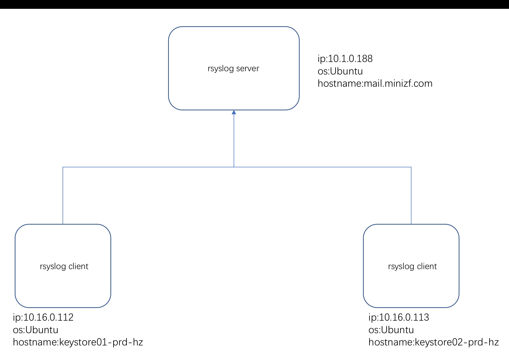

# 利用免费工具实现安全日志审计

## 需求
  将每台服务器上的每个用户登陆退出、执行的命令、执行时间、登录时间、主机ip、当前切换用户等信息保存到本地并实时传输至日志服务器进行异地保存。


|    IP       |      hostname     |      角色       |
|    ----     |      -----        |      ----      |
| 10.1.0.188  | mail.minizf.com   | rsyslog-server |
| 10.16.0.112 | keystore01-prd-hz | rsyslog-client |
| 10.16.0.113 | keystore02-prd-hz | rsyslog-client |

## 环境部署图



## 工具及服务

### logger 

logger是一个shell接口，可以通过该接口使用rsyslog的日志模块。


usage: logger [-is] [-f file] [-p pri] [-t tag] [-u socket] [ message ... ]  
-i 逐行记录每一次logger的进程id  
-f file记录特定的文件  
-p 输入消息的特定优先级，默认是'user.notice'  
-t tag为每行信息打上特定的标签  
-u 以特定的socker代替内嵌系统常规工作123456  

### rsyslog日志服务器 

rsyslog是syslog的加强版，一个快速处理收集系统日志的程序，可以用作客户端及服务器，我们可以使用local0～local7来自定义设备传输至rsyslog。

ryslog提供了高性能、安全功能和模块化设计。rsyslog 是syslog 的升级版，它将多种来源输入输出转换结果到目的地，据官网介绍，现在可以处理100万条信息。

特性：1.多线程

　　　2.支持加密协议：ssl，tls，relp

　　　3.mysql、oracle、postgreSQL

　　　4.等等..

### PROMPT_COMMAND变量 

Linux系统的环境变量PROMPTCOMMAND的内容会在bash提示符显示之前被执行。利用记录下出现提示符前面的命令这个特性可以实现记录所有用户的操作记录。

该环境变量的默认值是` history -a `功能是将目前新增的history追加到histfiles 中，默认写入隐藏文件~/.bashhistory中

## 实现

### 配置rsyslog日志服务器

使用命令`vim /etc/rsyslog.conf`编辑rsyslog.conf文件：

```
#添加以下几行

#启动udp端口也可以是tcp端口
#允许udp协议传输
$ModLoad imudp
$UDPServerRun 514
#允许tcp协议传输
$ModLoad imtcp
$InputTCPServerRun 514
#设置白名单
$AllowedSender TCP, 10.0.0.0/8
#配置模板，以客户端ip为目录，以日期命名文件
$template IpTemplate,"/var/log/remote/%FROMHOST-IP%/%$YEAR%-%$MONTH%-%$DAY%.log"
#把非本地传输的日志按照指定的模板存放
:fromhost-ip, !isequal, "127.0.0.1" ?IpTemplate
# & 表示已经匹配处理的内容，~ 表示不再进行其他处理
& ~
````

重启服务:

```
service rsyslog restart

```

### 配置rsyslog客户端

#### 配置PROMP_COMMAND


使用命令 `vim /etc/bashrc`打开bashrc文件：

```
readonly PROMPT_COMMAND='logger -p local3.notice -t bash "$(ifconfig | grep -E "eth|em" -A 1 | grep "10.10" | grep -oP "(?<=addr:)[\d\.]+")  $(who am i |awk "{print \$1\" \"\$2\" \"\$3\" \"\$4\" \"\$5}") [`pwd`] currentuser=$(whoami) command=$(history 1 | { read x cmd; echo "$cmd"; })"'
```
使用命令`source /etc/bashrc`更新bashrc文件。

其中：  
1.local3.notice 使我们自定义的设备，用于rsyslog调用；  
2.bash 是我们为每行打印的信息打印的tag；  
3.ifconfig | grep -E “eth|em” -A 1 | grep “10.10” | grep -oP “(?<=addr:)[\d.]+用于获取我们服务器的ip；  
4.who am i |awk “{print $1\” \”$2\” \”$3\” \”$4\” \”$5}”用于获取我们当前用户的登录信息；  
5.pwd用于列出我们当前所在的目录；  
6.whoami用于获取我们当前切换的执行命令的用户，例如我们从test 用户 sudo -i，执行命令的用户为root，但是登录的用户test，方便我们区分；  
7.command 是我们当前用户执行的命令。

> 注意：  
1.我们需要在/etc/bashrc或/etc/profile中添加环境变量，用于所有用户。  
2.export PROMPT_COMMAND 如果将PROMPT_COMMAND导出到用户工作区，那么对于有经验的用户就可以做赋值操作 export PROMPT_COMMAND =“” ，简单的语法就会导致记录功能当前session端不可用，所以PROMPT_COMMAND必须设置成只读的属性，readonly PROMPT_COMMAND

#### 配置rsyslog客户端


使用命令`vim /etc/rsyslog.conf`编辑`rsyslog.conf`文件：

```
#添加如下行
#添加local3.none，在第一行加入local3.none,使得设备local3的日志不记录在messages文件里
*.info;mail.none;authpriv.none;cron.none;local3.none                /var/log/messages
#保存到本地的文件
local3.notice /var/log/audit.log
#远程日志服务器
local3.notice @@10.1.0.188:514
```
重启服务：

```
service rsyslog restart

```

>其中： 
1.local3.notice 是在logger中定义的设备，rsyslog调用并将打印信息输出至指定文件。    
2.添加local3.none是避免日志写入/var/log/messages    
3.这里的@告诉syslog使用 UDP 协议发送日志，要使用 TCP 的话，使用 @@。  

#### 配置轮转日志

使用命令`vim /etc/logrotate.d/rsyslog`修改rsyslog文件：

```
/var/log/audit.log{
    daily
    rotate 4
    missingok
    notifempty
    nocompress
    create
    dateext
    sharedscripts
    postrotate
        /bin/kill -HUP `cat /var/run/syslogd.pid 2> /dev/null` 2> /dev/null || true
    endscript
}
```

#使用命令`logrotate -vf /etc/logrotate.d/rsyslog`强制轮转

```
logrotate -vf /etc/logrotate.d/rsyslog
```

使用命令`ls /var/log|grep audit`查看：

```
admin@keystore01-prd-hz:/etc/logrotate.d$ ls /var/log|grep audit
audit
audit.log
audit.log-20180929
admin@keystore01-prd-hz:/etc/logrotate.d$ 
```


## 测试

### rsyslog客户端


在keystore01-prd-hz上面执行操作：
```
admin@keystore01-prd-hz:~$ ls
gob  pkm  test  zabbix  zabbix-saasagent.tar.gz
admin@keystore01-prd-hz:~$ ls
gob  pkm  test  zabbix  zabbix-saasagent.tar.gz
admin@keystore01-prd-hz:~$ a
a: command not found
admin@keystore01-prd-hz:~$ sudo -i
root@keystore01-prd-hz:~# ls
install_docker.sh  test
root@keystore01-prd-hz:~#
```


#查看日志文件

```
Sep 29 10:54:19 iZbp18l0u5sq2hzabgnz31Z bash: 10.16.0.112  admin pts/0 2018-09-29 09:36 (10.6.0.69) [/home/admin] currentuser=admin command=ls
Sep 29 10:54:26 iZbp18l0u5sq2hzabgnz31Z bash: 10.16.0.112  admin pts/0 2018-09-29 09:36 (10.6.0.69) [/home/admin] currentuser=admin command=a
Sep 29 10:54:38 iZbp18l0u5sq2hzabgnz31Z bash: 10.16.0.112  admin pts/0 2018-09-29 09:36 (10.6.0.69) [/root] currentuser=root command=exit

Sep 29 10:54:56 iZbp18l0u5sq2hzabgnz31Z bash: 10.16.0.112  admin pts/0 2018-09-29 09:36 (10.6.0.69) [/root] currentuser=root command=ls
Sep 29 10:56:18 iZbp18l0u5sq2hzabgnz31Z bash: 10.16.0.112  admin pts/0 2018-09-29 09:36 (10.6.0.69) [/root] currentuser=root command=ls
Sep 29 10:56:19 iZbp18l0u5sq2hzabgnz31Z bash: 10.16.0.112  admin pts/0 2018-09-29 09:36 (10.6.0.69) [/root] currentuser=root command=ls
Sep 29 10:56:26 iZbp18l0u5sq2hzabgnz31Z bash: 10.16.0.112  admin pts/0 2018-09-29 09:36 (10.6.0.69) [/root] currentuser=root command=hostname
```


注意：我们切换成root的记录，登录用户仍为test，但是我们通过currentuser=root得知test用户已经切换成root了

### rsyslog服务器

验证，在服务器上进到 /var/log/remote 目录下，进行查看，会发现以下类似的文件结构:

```
admin@mail:/var/log/remote/10.16.0.112$ 
admin@mail:/var/log/remote/10.16.0.112$ tree /var/log/remote
/var/log/remote
├── 10.16.0.112
│   └── 2018-09-28.log
└── 10.16.0.113
    └── 2018-09-28.log

2 directories, 2 files
admin@mail:/var/log/remote/10.16.0.112$ 
admin@mail:/var/log/remote/10.16.0.112$ 
```

使用keystore服务器举例：

```
admin@mail:/var/log/remote/10.16.0.112$ 
admin@mail:/var/log/remote/10.16.0.112$ sudo tail -f 2018-09-28.log 
Sep 28 20:23:47 iZbp18l0u5sq2hzabgnz31Z bash: 10.16.0.112  admin pts/2 2018-09-28 19:02 (10.6.0.69) [/home/admin] currentuser=admin command=hostname
Sep 28 21:00:09 iZbp18l0u5sq2hzabgnz31Z bash: 10.16.0.112  admin pts/2 2018-09-28 19:02 (10.6.0.69) [/home/admin] currentuser=admin command=hostname
Sep 28 21:00:09 iZbp18l0u5sq2hzabgnz31Z bash: message repeated 4 times: [ 10.16.0.112  admin pts/2 2018-09-28 19:02 (10.6.0.69) [/home/admin] currentuser=admin command=hostname]
Sep 28 21:00:16 iZbp18l0u5sq2hzabgnz31Z bash: 10.16.0.112  admin pts/2 2018-09-28 19:02 (10.6.0.69) [/home/admin] currentuser=admin command=cd /var/lo
Sep 28 21:00:19 iZbp18l0u5sq2hzabgnz31Z bash: 10.16.0.112  admin pts/2 2018-09-28 19:02 (10.6.0.69) [/var/log] currentuser=admin command=cd /var/log
Sep 28 21:00:20 iZbp18l0u5sq2hzabgnz31Z bash: 10.16.0.112  admin pts/2 2018-09-28 19:02 (10.6.0.69) [/var/log] currentuser=admin command=ls
Sep 28 21:00:50 iZbp18l0u5sq2hzabgnz31Z bash: 10.16.0.112  admin pts/2 2018-09-28 19:02 (10.6.0.69) [/var/log] currentuser=admin command=cat audit.log
Sep 28 21:00:57 iZbp18l0u5sq2hzabgnz31Z bash: 10.16.0.112  admin pts/2 2018-09-28 19:02 (10.6.0.69) [/var/log] currentuser=admin command=sudo cat audit.log
Sep 28 21:02:04 iZbp18l0u5sq2hzabgnz31Z bash: message repeated 3 times: [ 10.16.0.112  admin pts/2 2018-09-28 19:02 (10.6.0.69) [/var/log] currentuser=admin command=sudo cat audit.log]
Sep 28 21:02:22 iZbp18l0u5sq2hzabgnz31Z bash: 10.16.0.112  admin pts/2 2018-09-28 19:02 (10.6.0.69) [/var/log] currentuser=admin command=cat /etc/rsyslog.conf
```

>**注意**：
>如果验证失败的话，先检查selinux 是否关闭。后将udp 514 端口和tcp 514端口允许10网段访问即可，或者关闭iptables 服务。另外说明阿里云上设置相应的安全组。该操作在每台机器上进行。


## 重构history记录


## 参考

**rsyslog**

- [https://blog.csdn.net/yanggd1987/article/details/70255179](https://blog.csdn.net/yanggd1987/article/details/70255179)
- [https://www.cnblogs.com/hanyifeng/p/5463338.html](https://www.cnblogs.com/hanyifeng/p/5463338.html)

**auditd**

- [https://www.ibm.com/developerworks/cn/linux/l-lo-use-space-audit-tool/index.html](https://www.ibm.com/developerworks/cn/linux/l-lo-use-space-audit-tool/index.html)

**logger**
- [https://blog.csdn.net/u011630575/article/details/52055116](https://blog.csdn.net/u011630575/article/details/52055116)

**重构history**

- [https://www.linuxidc.com/Linux/2017-01/139284.htm](https://www.linuxidc.com/Linux/2017-01/139284.htm)
- [https://blog.csdn.net/stinkstone/article/details/79200665](https://blog.csdn.net/stinkstone/article/details/79200665)